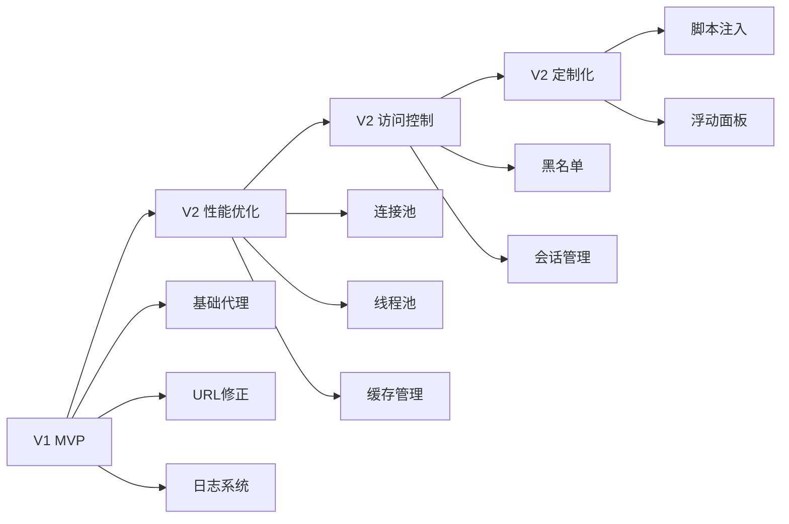

# SilkRoad-Next V2 版本详细开发文档

## 一、V2 版本概述

### 1.1 版本目标
V2 版本的核心目标是**性能优化、访问控制与定制化**。在 V1 基础代理功能的基础上，V2 引入高并发支持、会话管理、缓存优化、访问控制和脚本注入等高级功能。

### 1.2 新增模块清单
- **核心性能模块**：
  - `modules/connectionpool.py` - 目标服务器连接池
  - `modules/threadpool.py` - 密集计算线程池
- **功能增强模块**：
  - `modules/sessions.py` - 客户端会话管理
  - `modules/cachemanager.py` - 缓存管理
  - `modules/blacklist.py` - 黑名单拦截逻辑
  - `modules/scripts.py` - 脚本注入逻辑
- **配置文件**：
  - `databases/blacklist.json` - 访问黑名单配置
  - `databases/scripts.json` - 脚本注入配置
- **脚本库**：
  - `Scripts/dock.js` - 浮动面板脚本
  - `Scripts/target.js` - 目标定位脚本
  - `Scripts/progress.js` - 进度条脚本
  - `Scripts/zoom.js` - 缩放功能脚本

### 1.3 V1 到 V2 的演进路线



---

## 二、V1 与 V2 的衔接

### 2.1 V1 核心架构回顾

V1 版本已经实现了以下核心功能：

```python
# V1 核心组件
class SilkRoad:
    def __init__(self):
        self.config = ConfigManager()          # 配置管理
        self.logger: Optional[Logger] = None   # 日志系统
        self.proxy_server: Optional[ProxyServer] = None  # 代理服务器
        self.command_handler: Optional[CommandHandler] = None  # 命令处理器
        self.shutdown_event = asyncio.Event()  # 关闭事件
```

**V1 已具备的能力**：
1. ✅ 基础反向代理功能
2. ✅ URL 修正引擎（HTML/CSS/JS/XML/JSON）
3. ✅ 配置管理系统（支持热重载接口）
4. ✅ 日志系统（基于 loguru）
5. ✅ 命令处理器（/command/*）
6. ✅ 优雅退出机制
7. ✅ UA 伪装
8. ✅ Cookie 隔离
9. ✅ 静态页面服务器

### 2.2 V2 扩展点

V2 在 V1 基础上扩展的关键点：

#### 2.2.1 配置文件扩展

V1 的 `config.json` 已经预留了 V2 的配置项：

```json
{
  "cache": {
    "enabled": false,  // V2 将启用
    "maxSize": 1073741824,
    "defaultTTL": 3600,
    "cleanupInterval": 300
  },
  "performance": {
    "connectionPool": {
      "enabled": false,  // V2 将启用
      "maxPoolSize": 100,
      "maxKeepaliveConnections": 20,
      "keepaliveTimeout": 30
    },
    "threadPool": {
      "enabled": false,  // V2 将启用
      "maxWorkers": 4,
      "queueSize": 1000
    }
  }
}
```

**V2 需要新增的配置项**：

```json
{
  "v2": {
    "session": {
      "enabled": true,
      "timeout": 1800,
      "cleanupInterval": 60,
      "maxDataSize": 1048576
    },
    "blacklist": {
      "enabled": true,
      "configFile": "databases/blacklist.json",
      "reloadInterval": 300
    },
    "scripts": {
      "enabled": true,
      "configFile": "databases/scripts.json",
      "reloadInterval": 300
    }
  }
}
```

#### 2.2.2 代理服务器扩展

V1 的 `ProxyServer` 需要集成 V2 模块：

```python
# V1 的 ProxyServer
class ProxyServer:
    def __init__(self, host: str, port: int, config, logger):
        self.host = host
        self.port = port
        self.config = config
        self.logger = logger
        
        # V1 组件
        self.url_handler = URLHandler(config, logger)
        self.ua_handler = UAHandler()
        self.cookie_handler = CookieHandler()
        self.page_server = PageServer(config, logger)
        
        # V2 新增组件（需要添加）
        self.connection_pool = None
        self.thread_pool = None
        self.session_manager = None
        self.cache_manager = None
        self.blacklist_manager = None
        self.script_injector = None
```

### 2.3 迁移策略

#### 2.3.1 渐进式迁移

V2 采用渐进式迁移策略，确保向后兼容：

**阶段 1：基础集成（无破坏性变更）**
- 在 V1 基础上添加 V2 模块
- 所有 V2 功能默认关闭
- 通过配置开关启用 V2 功能

**阶段 2：功能增强**
- 启用连接池和线程池
- 启用缓存管理
- 启用会话管理

**阶段 3：高级功能**
- 启用黑名单拦截
- 启用脚本注入
- 完整的 V2 功能集

#### 2.3.2 配置兼容性

V2 保持与 V1 配置的完全兼容：

```python
# V1 配置仍然有效
config = ConfigManager()
await config.load()

# V1 功能继续工作
proxy_port = config.get('server.proxy.port', 8080)

# V2 新增配置（可选）
if config.get('v2.session.enabled', False):
    session_manager = SessionManager()
```

---

## 三、核心模块详细设计

### 3.1 连接池模块

#### 3.1.1 设计目标
维护与高频目标服务器的长连接（Keep-Alive），降低 TLS 握手开销，提升请求响应速度。

#### 3.1.2 与 V1 的集成

**V1 的连接管理方式**：
```python
# V1: 每次请求创建新连接
async with aiohttp.ClientSession() as session:
    async with session.get(url) as response:
        data = await response.read()
```

**V2 的连接池方式**：
```python
# V2: 复用连接池
connection = await self.connection_pool.get_connection(host, port)
if connection is None:
    # 创建新连接
    connector = aiohttp.TCPConnector()
    session = aiohttp.ClientSession(connector=connector)
else:
    # 复用现有连接
    session = aiohttp.ClientSession(connector=connection)

# 使用后归还连接
await self.connection_pool.return_connection(host, port, session.connector)
```

#### 3.1.3 核心架构

```python
import asyncio
import aiohttp
from typing import Dict, Optional
from datetime import datetime, timedelta
import time

class ConnectionPool:
    """
    目标服务器连接池管理器
    
    功能：
    1. 维护与目标服务器的长连接
    2. 自动清理过期连接
    3. 连接健康检查
    4. 连接复用与限制
    """
    
    def __init__(self, 
                 max_connections_per_host: int = 10,
                 connection_timeout: int = 30,
                 keep_alive_timeout: int = 60):
        """
        初始化连接池
        
        Args:
            max_connections_per_host: 每个目标主机的最大连接数
            connection_timeout: 连接超时时间（秒）
            keep_alive_timeout: Keep-Alive 超时时间（秒）
        """
        self.max_connections_per_host = max_connections_per_host
        self.connection_timeout = connection_timeout
        self.keep_alive_timeout = keep_alive_timeout
        
        # 连接池存储结构：{host: [connection1, connection2, ...]}
        self._pools: Dict[str, list] = {}
        
        # 连接使用记录：{connection_id: last_used_time}
        self._connection_usage: Dict[str, float] = {}
        
        # 连接创建时间记录：{connection_id: created_time}
        self._connection_created: Dict[str, float] = {}
        
        # 锁机制，确保线程安全
        self._lock = asyncio.Lock()
        
        # 统计信息
        self.stats = {
            'total_connections': 0,
            'active_connections': 0,
            'reuse_count': 0,
            'timeout_cleanups': 0
        }
    
    async def get_connection(self, 
                            host: str, 
                            port: int = 443, 
                            is_https: bool = True) -> Optional[aiohttp.TCPConnector]:
        """
        从连接池获取一个可用连接
        
        Args:
            host: 目标主机名
            port: 目标端口
            is_https: 是否为 HTTPS 连接
            
        Returns:
            可用的连接对象，如果没有可用连接则返回 None
        """
        async with self._lock:
            pool_key = f"{host}:{port}"
            
            # 检查连接池中是否有可用连接
            if pool_key in self._pools and self._pools[pool_key]:
                # 从池中取出最后一个连接（LIFO策略）
                connection = self._pools[pool_key].pop()
                
                # 检查连接是否仍然有效
                if await self._is_connection_valid(connection):
                    self.stats['reuse_count'] += 1
                    self.stats['active_connections'] += 1
                    return connection
                else:
                    # 连接已失效，关闭并移除
                    await self._close_connection(connection)
            
            # 没有可用连接，检查是否可以创建新连接
            current_count = len(self._pools.get(pool_key, []))
            if current_count < self.max_connections_per_host:
                # 可以创建新连接，返回 None 让调用者创建
                return None
            else:
                # 已达到最大连接数限制
                raise ConnectionError(f"Connection pool for {pool_key} is full")
    
    async def return_connection(self, 
                                host: str, 
                                port: int, 
                                connection: aiohttp.TCPConnector):
        """
        将连接归还到连接池
        
        Args:
            host: 目标主机名
            port: 目标端口
            connection: 要归还的连接对象
        """
        async with self._lock:
            pool_key = f"{host}:{port}"
            
            # 检查连接是否仍然有效
            if await self._is_connection_valid(connection):
                # 将连接放回池中
                if pool_key not in self._pools:
                    self._pools[pool_key] = []
                
                self._pools[pool_key].append(connection)
                
                # 更新使用时间
                connection_id = id(connection)
                self._connection_usage[connection_id] = time.time()
                
                self.stats['active_connections'] -= 1
            else:
                # 连接已失效，直接关闭
                await self._close_connection(connection)
    
    async def _is_connection_valid(self, connection: aiohttp.TCPConnector) -> bool:
        """
        检查连接是否仍然有效
        
        Args:
            connection: 要检查的连接对象
            
        Returns:
            连接是否有效
        """
        try:
            # 检查连接是否已关闭
            if connection.closed:
                return False
            
            # 检查连接是否超时
            connection_id = id(connection)
            if connection_id in self._connection_usage:
                last_used = self._connection_usage[connection_id]
                if time.time() - last_used > self.keep_alive_timeout:
                    return False
            
            return True
        except Exception:
            return False
    
    async def _close_connection(self, connection: aiohttp.TCPConnector):
        """
        关闭连接并清理相关资源
        
        Args:
            connection: 要关闭的连接对象
        """
        try:
            connection_id = id(connection)
            
            # 关闭连接
            if not connection.closed:
                await connection.close()
            
            # 清理记录
            if connection_id in self._connection_usage:
                del self._connection_usage[connection_id]
            
            if connection_id in self._connection_created:
                del self._connection_created[connection_id]
            
            self.stats['total_connections'] -= 1
        except Exception as e:
            # 记录错误日志
            pass
    
    async def cleanup_expired_connections(self):
        """
        清理所有过期的连接
        """
        async with self._lock:
            current_time = time.time()
            expired_connections = []
            
            # 遍历所有连接池
            for pool_key, connections in self._pools.items():
                for connection in connections[:]:  # 使用切片创建副本进行遍历
                    connection_id = id(connection)
                    
                    # 检查是否超时
                    if connection_id in self._connection_usage:
                        last_used = self._connection_usage[connection_id]
                        if current_time - last_used > self.keep_alive_timeout:
                            expired_connections.append((pool_key, connection))
            
            # 关闭过期连接
            for pool_key, connection in expired_connections:
                await self._close_connection(connection)
                self._pools[pool_key].remove(connection)
                self.stats['timeout_cleanups'] += 1
    
    async def get_stats(self) -> dict:
        """
        获取连接池统计信息
        
        Returns:
            统计信息字典
        """
        return {
            **self.stats,
            'pools': {
                pool_key: len(connections) 
                for pool_key, connections in self._pools.items()
            }
        }
    
    async def close_all(self):
        """
        关闭所有连接，用于优雅退出
        """
        async with self._lock:
            for pool_key, connections in self._pools.items():
                for connection in connections:
                    await self._close_connection(connection)
            
            self._pools.clear()
            self._connection_usage.clear()
            self._connection_created.clear()
```

#### 3.1.4 使用示例

**示例 1：基础使用**

```python
import asyncio
import aiohttp

async def example_usage():
    # 创建连接池
    pool = ConnectionPool(
        max_connections_per_host=10,
        connection_timeout=30,
        keep_alive_timeout=60
    )
    
    try:
        # 获取连接
        connection = await pool.get_connection('www.example.com', 443, True)
        
        if connection is None:
            # 没有可用连接，创建新连接
            connector = aiohttp.TCPConnector(
                limit=10,
                limit_per_host=10,
                ttl_dns_cache=300
            )
            session = aiohttp.ClientSession(connector=connector)
        else:
            # 使用现有连接
            session = aiohttp.ClientSession(connector=connection)
        
        # 使用 session 发起请求
        async with session.get('https://www.example.com') as response:
            html = await response.text()
            print(f"Response status: {response.status}")
        
        # 归还连接
        await pool.return_connection('www.example.com', 443, session.connector)
        
    finally:
        # 关闭所有连接
        await pool.close_all()

# 运行示例
asyncio.run(example_usage())
```

**示例 2：集成到 V1 的 ProxyServer**

```python
# 在 ProxyServer 中集成连接池
class ProxyServer:
    def __init__(self, host: str, port: int, config, logger):
        # ... V1 初始化代码 ...
        
        # V2: 初始化连接池
        if config.get('performance.connectionPool.enabled', False):
            self.connection_pool = ConnectionPool(
                max_connections_per_host=config.get('performance.connectionPool.maxPoolSize', 100),
                connection_timeout=config.get('server.proxy.connectionTimeout', 30),
                keep_alive_timeout=config.get('performance.connectionPool.keepaliveTimeout', 30)
            )
            logger.info("连接池已启用")
        else:
            self.connection_pool = None
    
    async def _forward_request(self, writer, method, target_url, headers, body):
        """转发请求（集成连接池）"""
        from urllib.parse import urlparse
        parsed = urlparse(target_url)
        host = parsed.netloc
        port = 443 if parsed.scheme == 'https' else 80
        
        # V2: 使用连接池
        if self.connection_pool:
            try:
                connection = await self.connection_pool.get_connection(
                    host, port, parsed.scheme == 'https'
                )
                
                if connection is None:
                    # 创建新连接
                    connector = aiohttp.TCPConnector()
                    session = aiohttp.ClientSession(connector=connector)
                else:
                    # 复用现有连接
                    session = aiohttp.ClientSession(connector=connection)
                
                try:
                    # 发送请求
                    async with session.request(
                        method, target_url, headers=headers, data=body,
                        allow_redirects=False, ssl=False
                    ) as response:
                        await self._send_response(writer, response, target_url)
                finally:
                    # 归还连接
                    await self.connection_pool.return_connection(
                        host, port, session.connector
                    )
                    await session.close()
                    
            except ConnectionError:
                # 连接池已满，降级到 V1 方式
                await self._forward_request_v1(writer, method, target_url, headers, body)
        else:
            # V1: 不使用连接池
            await self._forward_request_v1(writer, method, target_url, headers, body)
```

#### 3.1.5 常见情况处理

**情况 1：连接池已满**

```python
try:
    connection = await pool.get_connection('www.example.com', 443, True)
except ConnectionError as e:
    # 连接池已满，等待一段时间后重试
    await asyncio.sleep(0.1)
    connection = await pool.get_connection('www.example.com', 443, True)
```

**情况 2：连接超时**

```python
# 定期清理过期连接
async def cleanup_task():
    while True:
        await asyncio.sleep(30)  # 每30秒清理一次
        await pool.cleanup_expired_connections()

# 在主程序中启动清理任务
asyncio.create_task(cleanup_task())
```

**情况 3：连接失效**

```python
async def safe_request(url: str, pool: ConnectionPool):
    """安全的请求方法，自动处理连接失效"""
    from urllib.parse import urlparse
    parsed = urlparse(url)
    host = parsed.netloc
    port = 443 if parsed.scheme == 'https' else 80
    
    max_retries = 3
    for attempt in range(max_retries):
        try:
            connection = await pool.get_connection(host, port, parsed.scheme == 'https')
            
            if connection is None:
                connector = aiohttp.TCPConnector()
                session = aiohttp.ClientSession(connector=connector)
            else:
                session = aiohttp.ClientSession(connector=connection)
            
            async with session.get(url, timeout=aiohttp.ClientTimeout(total=30)) as response:
                data = await response.text()
                await pool.return_connection(host, port, session.connector)
                return data
                
        except Exception as e:
            if attempt == max_retries - 1:
                raise
            await asyncio.sleep(1)
```

---

### 3.2 线程池模块

#### 3.2.1 设计目标
将 CPU 密集型任务（如解压缩、大规模正则替换）交由独立线程池处理，防止阻塞主异步事件循环。

#### 3.2.2 与 V1 的集成

**V1 的处理方式**：
```python
# V1: 在主事件循环中直接处理
content = await response.read()
content = gzip.decompress(content)  # 可能阻塞事件循环
content = self.url_handler.rewrite(content, content_type, target_url)
```

**V2 的线程池方式**：
```python
# V2: 在线程池中处理 CPU 密集型任务
content = await response.read()

# 在线程池中解压缩
content = await self.thread_pool.run_in_thread(
    gzip.decompress, content,
    timeout=10.0
)

# 在线程池中执行 URL 修正
content = await self.thread_pool.run_in_thread(
    self.url_handler.rewrite,
    content, content_type, target_url,
    timeout=10.0
)
```

#### 3.2.3 核心架构

```python
import asyncio
from concurrent.futures import ThreadPoolExecutor
from typing import Callable, Any, Optional
import functools

class ThreadPoolManager:
    """
    线程池管理器
    
    功能：
    1. 管理 CPU 密集型任务的执行
    2. 防止阻塞主事件循环
    3. 任务优先级调度
    4. 任务超时控制
    """
    
    def __init__(self, max_workers: Optional[int] = None):
        """
        初始化线程池
        
        Args:
            max_workers: 最大工作线程数，默认为 CPU 核心数 * 2
        """
        self.executor = ThreadPoolExecutor(max_workers=max_workers)
        self.loop = None
        
        # 任务统计
        self.stats = {
            'total_tasks': 0,
            'completed_tasks': 0,
            'failed_tasks': 0,
            'average_execution_time': 0.0
        }
    
    def set_event_loop(self, loop: asyncio.AbstractEventLoop):
        """
        设置事件循环
        
        Args:
            loop: asyncio 事件循环
        """
        self.loop = loop
    
    async def run_in_thread(self, 
                           func: Callable, 
                           *args, 
                           timeout: Optional[float] = None,
                           **kwargs) -> Any:
        """
        在线程池中运行 CPU 密集型任务
        
        Args:
            func: 要执行的函数
            *args: 函数位置参数
            timeout: 任务超时时间（秒）
            **kwargs: 函数关键字参数
            
        Returns:
            函数执行结果
            
        Raises:
            asyncio.TimeoutError: 任务超时
            Exception: 任务执行失败
        """
        if self.loop is None:
            self.loop = asyncio.get_event_loop()
        
        import time
        start_time = time.time()
        
        try:
            self.stats['total_tasks'] += 1
            
            # 使用 functools.partial 绑定参数
            if kwargs:
                func_partial = functools.partial(func, *args, **kwargs)
            else:
                func_partial = functools.partial(func, *args)
            
            # 在线程池中执行
            future = self.loop.run_in_executor(self.executor, func_partial)
            
            # 设置超时
            if timeout:
                result = await asyncio.wait_for(future, timeout=timeout)
            else:
                result = await future
            
            # 更新统计信息
            execution_time = time.time() - start_time
            self.stats['completed_tasks'] += 1
            self._update_average_time(execution_time)
            
            return result
            
        except asyncio.TimeoutError:
            self.stats['failed_tasks'] += 1
            raise
        except Exception as e:
            self.stats['failed_tasks'] += 1
            raise
    
    def _update_average_time(self, execution_time: float):
        """
        更新平均执行时间
        
        Args:
            execution_time: 本次执行时间
        """
        completed = self.stats['completed_tasks']
        current_avg = self.stats['average_execution_time']
        
        # 计算新的平均值
        new_avg = (current_avg * (completed - 1) + execution_time) / completed
        self.stats['average_execution_time'] = new_avg
    
    async def run_batch(self, 
                       tasks: list, 
                       timeout: Optional[float] = None) -> list:
        """
        批量执行多个任务
        
        Args:
            tasks: 任务列表，每个元素为 (func, args, kwargs) 元组
            timeout: 单个任务超时时间
            
        Returns:
            结果列表，顺序与输入一致
        """
        futures = []
        
        for task in tasks:
            if len(task) == 2:
                func, args = task
                kwargs = {}
            else:
                func, args, kwargs = task
            
            future = self.run_in_thread(func, *args, timeout=timeout, **kwargs)
            futures.append(future)
        
        # 并发执行所有任务
        results = await asyncio.gather(*futures, return_exceptions=True)
        
        return results
    
    def get_stats(self) -> dict:
        """
        获取线程池统计信息
        
        Returns:
            统计信息字典
        """
        return {
            **self.stats,
            'max_workers': self.executor._max_workers,
            'active_threads': len([t for t in self.executor._threads if t.is_alive()])
        }
    
    def shutdown(self, wait: bool = True):
        """
        关闭线程池
        
        Args:
            wait: 是否等待所有任务完成
        """
        self.executor.shutdown(wait=wait)
```

#### 3.2.4 使用示例

**示例 1：执行大规模正则替换**

```python
import asyncio
import re

async def example_usage():
    # 创建线程池
    thread_pool = ThreadPoolManager(max_workers=8)
    
    try:
        # 示例：执行大规模正则替换
        html_content = "<html>...</html>"  # 假设这是大型 HTML 内容
        
        def replace_urls(html: str) -> str:
            """CPU 密集型任务：大规模 URL 替换"""
            # 预编译正则表达式
            url_pattern = re.compile(r'https?://[^\s<>"]+|www\.[^\s<>"]+')
            
            # 执行替换
            def replace_match(match):
                url = match.group(0)
                return f"/proxy/{url}"
            
            return url_pattern.sub(replace_match, html)
        
        # 在线程池中执行
        result = await thread_pool.run_in_thread(
            replace_urls, 
            html_content,
            timeout=10.0
        )
        
        print(f"URL replacement completed: {len(result)} chars")
        
    finally:
        # 关闭线程池
        thread_pool.shutdown()

# 运行示例
asyncio.run(example_usage())
```

**示例 2：批量解压缩**

```python
import gzip

async def batch_decompress():
    thread_pool = ThreadPoolManager(max_workers=8)
    
    try:
        # 假设有多个压缩数据
        compressed_data_list = [b'...'] * 10
        
        def decompress_gzip(data: bytes) -> bytes:
            """解压缩 gzip 数据"""
            return gzip.decompress(data)
        
        # 准备批量任务
        tasks = [
            (decompress_gzip, (data,), {})
            for data in compressed_data_list
        ]
        
        # 批量执行
        results = await thread_pool.run_batch(tasks, timeout=5.0)
        
        print(f"Decompressed {len(results)} items")
        
    finally:
        thread_pool.shutdown()
```

**示例 3：集成到 V1 的 ProxyServer**

```python
class ProxyServer:
    def __init__(self, host: str, port: int, config, logger):
        # ... V1 初始化代码 ...
        
        # V2: 初始化线程池
        if config.get('performance.threadPool.enabled', False):
            self.thread_pool = ThreadPoolManager(
                max_workers=config.get('performance.threadPool.maxWorkers', 4)
            )
            logger.info("线程池已启用")
        else:
            self.thread_pool = None
    
    async def _send_response(self, writer, response, target_url):
        """发送响应（集成线程池）"""
        try:
            content = await response.read()
            
            # V2: 在线程池中解压缩
            if self.thread_pool:
                content = await self.thread_pool.run_in_thread(
                    self._decompress_content,
                    content,
                    response.headers.get('Content-Encoding'),
                    timeout=10.0
                )
            else:
                # V1: 直接解压缩
                content = await self._decompress_content(
                    content,
                    response.headers.get('Content-Encoding')
                )
            
            # URL 修正
            content_type = response.headers.get('Content-Type', '')
            if self._should_rewrite(content_type):
                if self.thread_pool:
                    # V2: 在线程池中执行 URL 修正
                    content = await self.thread_pool.run_in_thread(
                        self.url_handler.rewrite,
                        content, content_type, target_url,
                        timeout=10.0
                    )
                else:
                    # V1: 直接执行 URL 修正
                    content = await self.url_handler.rewrite(
                        content, content_type, target_url
                    )
            
            # ... 后续处理 ...
            
        except Exception as e:
            self.logger.error(f"发送响应失败: {e}")
            raise
```

#### 3.2.5 常见情况处理

**情况 1：任务超时**

```python
async def safe_task_with_timeout():
    """带超时保护的任务执行"""
    try:
        result = await thread_pool.run_in_thread(
            cpu_intensive_function,
            data,
            timeout=5.0  # 5秒超时
        )
        return result
    except asyncio.TimeoutError:
        print("Task timeout, using fallback method")
        # 使用降级方案
        return fallback_function(data)
```

**情况 2：任务失败重试**

```python
async def retry_task(func, *args, max_retries=3, **kwargs):
    """带重试机制的任务执行"""
    for attempt in range(max_retries):
        try:
            return await thread_pool.run_in_thread(func, *args, **kwargs)
        except Exception as e:
            if attempt == max_retries - 1:
                raise
            await asyncio.sleep(1)
```

**情况 3：任务优先级调度**

```python
class PriorityThreadPool(ThreadPoolManager):
    """支持优先级的线程池"""
    
    def __init__(self, max_workers=None):
        super().__init__(max_workers)
        self.high_priority_executor = ThreadPoolExecutor(max_workers=max_workers // 2)
        self.normal_priority_executor = ThreadPoolExecutor(max_workers=max_workers // 2)
    
    async def run_with_priority(self, func, *args, priority='normal', **kwargs):
        """
        按优先级执行任务
        
        Args:
            priority: 'high' 或 'normal'
        """
        executor = (self.high_priority_executor 
                   if priority == 'high' 
                   else self.normal_priority_executor)
        
        loop = asyncio.get_event_loop()
        future = loop.run_in_executor(executor, functools.partial(func, *args, **kwargs))
        
        return await future
```

---

### 3.3 会话管理模块

#### 3.3.1 设计目标
管理客户端会话状态，支持会话持久化、会话超时清理、会话数据共享等功能。

#### 3.3.2 与 V1 的集成

V1 没有会话管理功能，V2 新增此功能：

```python
# V2: 在 ProxyServer 中集成会话管理
class ProxyServer:
    def __init__(self, host: str, port: int, config, logger):
        # ... V1 初始化代码 ...
        
        # V2: 初始化会话管理器
        if config.get('v2.session.enabled', False):
            self.session_manager = SessionManager(
                session_timeout=config.get('v2.session.timeout', 1800),
                cleanup_interval=config.get('v2.session.cleanupInterval', 60)
            )
            logger.info("会话管理器已启用")
        else:
            self.session_manager = None
```

#### 3.3.3 核心架构

```python
import asyncio
import time
import json
from typing import Dict, Any, Optional
from datetime import datetime
import uuid

class SessionManager:
    """
    客户端会话管理器
    
    功能：
    1. 会话创建与销毁
    2. 会话数据存储
    3. 会话超时清理
    4. 会话持久化
    """
    
    def __init__(self, 
                 session_timeout: int = 1800,
                 cleanup_interval: int = 60):
        """
        初始化会话管理器
        
        Args:
            session_timeout: 会话超时时间（秒），默认30分钟
            cleanup_interval: 清理间隔（秒），默认60秒
        """
        self.session_timeout = session_timeout
        self.cleanup_interval = cleanup_interval
        
        # 会话存储：{session_id: session_data}
        self._sessions: Dict[str, dict] = {}
        
        # 会话最后访问时间：{session_id: last_access_time}
        self._last_access: Dict[str, float] = {}
        
        # 锁机制
        self._lock = asyncio.Lock()
        
        # 统计信息
        self.stats = {
            'total_sessions': 0,
            'active_sessions': 0,
            'expired_sessions': 0
        }
    
    async def create_session(self, 
                            client_ip: str,
                            user_agent: str = '',
                            initial_data: Optional[dict] = None) -> str:
        """
        创建新会话
        
        Args:
            client_ip: 客户端 IP 地址
            user_agent: 客户端 User-Agent
            initial_data: 初始会话数据
            
        Returns:
            会话 ID
        """
        async with self._lock:
            # 生成唯一会话 ID
            session_id = self._generate_session_id()
            
            # 创建会话数据
            session_data = {
                'session_id': session_id,
                'client_ip': client_ip,
                'user_agent': user_agent,
                'created_at': datetime.now().isoformat(),
                'data': initial_data or {}
            }
            
            # 存储会话
            self._sessions[session_id] = session_data
            self._last_access[session_id] = time.time()
            
            # 更新统计
            self.stats['total_sessions'] += 1
            self.stats['active_sessions'] += 1
            
            return session_id
    
    async def get_session(self, session_id: str) -> Optional[dict]:
        """
        获取会话数据
        
        Args:
            session_id: 会话 ID
            
        Returns:
            会话数据，如果会话不存在或已过期则返回 None
        """
        async with self._lock:
            # 检查会话是否存在
            if session_id not in self._sessions:
                return None
            
            # 检查会话是否过期
            if self._is_session_expired(session_id):
                await self._delete_session(session_id)
                return None
            
            # 更新最后访问时间
            self._last_access[session_id] = time.time()
            
            return self._sessions[session_id]
    
    async def update_session(self, 
                            session_id: str, 
                            data: Dict[str, Any]) -> bool:
        """
        更新会话数据
        
        Args:
            session_id: 会话 ID
            data: 要更新的数据
            
        Returns:
            更新是否成功
        """
        async with self._lock:
            # 检查会话是否存在
            if session_id not in self._sessions:
                return False
            
            # 检查会话是否过期
            if self._is_session_expired(session_id):
                await self._delete_session(session_id)
                return False
            
            # 更新数据
            self._sessions[session_id]['data'].update(data)
            self._last_access[session_id] = time.time()
            
            return True
    
    async def delete_session(self, session_id: str) -> bool:
        """
        删除会话
        
        Args:
            session_id: 会话 ID
            
        Returns:
            删除是否成功
        """
        async with self._lock:
            return await self._delete_session(session_id)
    
    async def _delete_session(self, session_id: str) -> bool:
        """
        内部删除会话方法（不加锁）
        
        Args:
            session_id: 会话 ID
            
        Returns:
            删除是否成功
        """
        if session_id in self._sessions:
            del self._sessions[session_id]
            del self._last_access[session_id]
            self.stats['active_sessions'] -= 1
            return True
        return False
    
    def _is_session_expired(self, session_id: str) -> bool:
        """
        检查会话是否过期
        
        Args:
            session_id: 会话 ID
            
        Returns:
            会话是否过期
        """
        if session_id not in self._last_access:
            return True
        
        last_access = self._last_access[session_id]
        return time.time() - last_access > self.session_timeout
    
    def _generate_session_id(self) -> str:
        """
        生成唯一会话 ID
        
        Returns:
            会话 ID
        """
        return str(uuid.uuid4())
    
    async def cleanup_expired_sessions(self):
        """
        清理过期会话
        """
        async with self._lock:
            expired_sessions = []
            
            # 找出所有过期会话
            for session_id in list(self._sessions.keys()):
                if self._is_session_expired(session_id):
                    expired_sessions.append(session_id)
            
            # 删除过期会话
            for session_id in expired_sessions:
                await self._delete_session(session_id)
                self.stats['expired_sessions'] += 1
    
    async def start_cleanup_task(self):
        """
        启动定期清理任务
        """
        while True:
            await asyncio.sleep(self.cleanup_interval)
            await self.cleanup_expired_sessions()
    
    async def get_session_by_ip(self, client_ip: str) -> Optional[dict]:
        """
        根据 IP 地址获取会话
        
        Args:
            client_ip: 客户端 IP 地址
            
        Returns:
            会话数据
        """
        async with self._lock:
            for session_data in self._sessions.values():
                if session_data['client_ip'] == client_ip:
                    session_id = session_data['session_id']
                    
                    # 检查是否过期
                    if not self._is_session_expired(session_id):
                        self._last_access[session_id] = time.time()
                        return session_data
                    
            return None
    
    async def save_to_file(self, file_path: str):
        """
        将会话数据保存到文件
        
        Args:
            file_path: 文件路径
        """
        async with self._lock:
            data = {
                'sessions': self._sessions,
                'last_access': self._last_access,
                'stats': self.stats
            }
            
            with open(file_path, 'w', encoding='utf-8') as f:
                json.dump(data, f, ensure_ascii=False, indent=2)
    
    async def load_from_file(self, file_path: str):
        """
        从文件加载会话数据
        
        Args:
            file_path: 文件路径
        """
        async with self._lock:
            try:
                with open(file_path, 'r', encoding='utf-8') as f:
                    data = json.load(f)
                
                self._sessions = data.get('sessions', {})
                self._last_access = data.get('last_access', {})
                self.stats = data.get('stats', self.stats)
                
            except FileNotFoundError:
                pass
    
    def get_stats(self) -> dict:
        """
        获取会话统计信息
        
        Returns:
            统计信息字典
        """
        return {
            **self.stats,
            'session_timeout': self.session_timeout
        }
```

#### 3.3.4 使用示例

**示例 1：基础使用**

```python
import asyncio

async def example_usage():
    # 创建会话管理器
    session_manager = SessionManager(
        session_timeout=1800,  # 30分钟
        cleanup_interval=60    # 每60秒清理一次
    )
    
    # 启动清理任务
    asyncio.create_task(session_manager.start_cleanup_task())
    
    try:
        # 创建会话
        session_id = await session_manager.create_session(
            client_ip='192.168.1.100',
            user_agent='Mozilla/5.0...',
            initial_data={'username': 'test_user'}
        )
        
        print(f"Created session: {session_id}")
        
        # 获取会话
        session_data = await session_manager.get_session(session_id)
        print(f"Session data: {session_data}")
        
        # 更新会话
        await session_manager.update_session(
            session_id,
            {'last_page': '/home', 'preferences': {'theme': 'dark'}}
        )
        
        # 再次获取会话
        updated_session = await session_manager.get_session(session_id)
        print(f"Updated session: {updated_session}")
        
        # 保存会话到文件
        await session_manager.save_to_file('sessions_backup.json')
        
        # 从文件加载会话
        await session_manager.load_from_file('sessions_backup.json')
        
    finally:
        pass

# 运行示例
asyncio.run(example_usage())
```

**示例 2：集成到 ProxyServer**

```python
class ProxyServer:
    async def _process_request(self, reader, writer):
        """处理请求（集成会话管理）"""
        # ... V1 代码 ...
        
        # 获取客户端 IP
        client_addr = writer.get_extra_info('peername')
        client_ip = client_addr[0] if client_addr else 'unknown'
        
        # V2: 会话管理
        if self.session_manager:
            # 尝试获取现有会话
            session = await self.session_manager.get_session_by_ip(client_ip)
            
            if session is None:
                # 创建新会话
                session_id = await session_manager.create_session(
                    client_ip=client_ip,
                    user_agent=headers.get('User-Agent', ''),
                    initial_data={
                        'first_visit': datetime.now().isoformat(),
                        'visit_count': 0
                    }
                )
                session = await self.session_manager.get_session(session_id)
            else:
                # 更新会话
                await self.session_manager.update_session(
                    session['session_id'],
                    {
                        'last_visit': datetime.now().isoformat(),
                        'visit_count': session['data'].get('visit_count', 0) + 1
                    }
                )
        
        # ... 继续处理请求 ...
```

#### 3.3.5 常见情况处理

**情况 1：会话不存在**

```python
async def safe_get_session(session_id: str):
    """安全获取会话"""
    session = await session_manager.get_session(session_id)
    
    if session is None:
        # 会话不存在或已过期，创建新会话
        new_session_id = await session_manager.create_session(
            client_ip='unknown',
            user_agent='unknown'
        )
        return await session_manager.get_session(new_session_id)
    
    return session
```

**情况 2：会话数据过大**

```python
class SessionManager:
    # ... 其他代码 ...
    
    async def update_session(self, session_id: str, data: dict) -> bool:
        """更新会话数据（带大小限制）"""
        async with self._lock:
            if session_id not in self._sessions:
                return False
            
            # 检查数据大小
            max_size = 1024 * 1024  # 1MB
            current_size = len(json.dumps(self._sessions[session_id]['data']))
            new_data_size = len(json.dumps(data))
            
            if current_size + new_data_size > max_size:
                raise ValueError("Session data size exceeds limit")
            
            # 更新数据
            self._sessions[session_id]['data'].update(data)
            self._last_access[session_id] = time.time()
            
            return True
```

**情况 3：并发访问冲突**

```python
async def atomic_update_session(session_id: str, key: str, value: Any):
    """原子性更新会话数据"""
    async with session_manager._lock:
        session = await session_manager.get_session(session_id)
        
        if session is None:
            return False
        
        # 读取-修改-写入（原子操作）
        session['data'][key] = value
        await session_manager.update_session(session_id, session['data'])
        
        return True
```

---

### 3.4 缓存管理模块

#### 3.4.1 设计目标
优化资源加载速度，减少重复请求，支持缓存过期、缓存大小限制、缓存清理等功能。

#### 3.4.2 与 V1 的集成

V1 的配置文件已经预留了缓存配置：

```json
{
  "cache": {
    "enabled": false,  // V2 将启用
    "maxSize": 1073741824,
    "defaultTTL": 3600,
    "cleanupInterval": 300
  }
}
```

V2 将实现完整的缓存管理功能。

#### 3.4.3 核心架构

```python
import asyncio
import time
import hashlib
import json
from typing import Dict, Any, Optional, Tuple
from datetime import datetime
import os

class CacheManager:
    """
    缓存管理器
    
    功能：
    1. 内存缓存与磁盘缓存
    2. 缓存过期管理
    3. LRU 淘汰策略
    4. 缓存大小限制
    """
    
    def __init__(self,
                 max_memory_cache_size: int = 100 * 1024 * 1024,  # 100MB
                 max_disk_cache_size: int = 1024 * 1024 * 1024,   # 1GB
                 default_ttl: int = 3600,  # 1小时
                 disk_cache_dir: str = './cache'):
        """
        初始化缓存管理器
        
        Args:
            max_memory_cache_size: 最大内存缓存大小（字节）
            max_disk_cache_size: 最大磁盘缓存大小（字节）
            default_ttl: 默认缓存过期时间（秒）
            disk_cache_dir: 磁盘缓存目录
        """
        self.max_memory_cache_size = max_memory_cache_size
        self.max_disk_cache_size = max_disk_cache_size
        self.default_ttl = default_ttl
        self.disk_cache_dir = disk_cache_dir
        
        # 内存缓存：{cache_key: (data, expire_time, size)}
        self._memory_cache: Dict[str, Tuple[bytes, float, int]] = {}
        
        # LRU 访问记录：{cache_key: last_access_time}
        self._lru_record: Dict[str, float] = {}
        
        # 当前缓存大小
        self._current_memory_size = 0
        self._current_disk_size = 0
        
        # 锁机制
        self._lock = asyncio.Lock()
        
        # 创建磁盘缓存目录
        os.makedirs(disk_cache_dir, exist_ok=True)
        
        # 统计信息
        self.stats = {
            'memory_hits': 0,
            'disk_hits': 0,
            'misses': 0,
            'evictions': 0,
            'total_cached_items': 0
        }
    
    def _generate_cache_key(self, url: str, method: str = 'GET', headers: dict = None) -> str:
        """
        生成缓存键
        
        Args:
            url: 请求 URL
            method: 请求方法
            headers: 请求头
            
        Returns:
            缓存键
        """
        # 组合 URL、方法和关键请求头
        key_data = f"{method}:{url}"
        
        if headers:
            # 只包含影响响应的请求头
            important_headers = ['accept', 'accept-encoding', 'accept-language']
            for header in important_headers:
                if header in headers:
                    key_data += f":{header}={headers[header]}"
        
        # 生成 MD5 哈希
        return hashlib.md5(key_data.encode()).hexdigest()
    
    async def get(self, 
                 url: str, 
                 method: str = 'GET', 
                 headers: dict = None) -> Optional[bytes]:
        """
        从缓存获取数据
        
        Args:
            url: 请求 URL
            method: 请求方法
            headers: 请求头
            
        Returns:
            缓存的数据，如果不存在或已过期则返回 None
        """
        cache_key = self._generate_cache_key(url, method, headers)
        
        async with self._lock:
            # 1. 尝试从内存缓存获取
            if cache_key in self._memory_cache:
                data, expire_time, size = self._memory_cache[cache_key]
                
                # 检查是否过期
                if time.time() < expire_time:
                    # 更新 LRU 记录
                    self._lru_record[cache_key] = time.time()
                    self.stats['memory_hits'] += 1
                    return data
                else:
                    # 过期，删除缓存
                    await self._delete_from_memory(cache_key)
            
            # 2. 尝试从磁盘缓存获取
            disk_data = await self._get_from_disk(cache_key)
            
            if disk_data is not None:
                # 更新 LRU 记录
                self._lru_record[cache_key] = time.time()
                self.stats['disk_hits'] += 1
                
                # 将磁盘缓存提升到内存缓存
                await self._set_to_memory(cache_key, disk_data, self.default_ttl)
                
                return disk_data
            
            # 3. 缓存未命中
            self.stats['misses'] += 1
            return None
    
    async def set(self,
                 url: str,
                 data: bytes,
                 method: str = 'GET',
                 headers: dict = None,
                 ttl: Optional[int] = None,
                 cache_to_disk: bool = True):
        """
        设置缓存
        
        Args:
            url: 请求 URL
            data: 要缓存的数据
            method: 请求方法
            headers: 请求头
            ttl: 缓存过期时间（秒）
            cache_to_disk: 是否缓存到磁盘
        """
        cache_key = self._generate_cache_key(url, method, headers)
        ttl = ttl or self.default_ttl
        
        async with self._lock:
            # 1. 设置内存缓存
            await self._set_to_memory(cache_key, data, ttl)
            
            # 2. 设置磁盘缓存
            if cache_to_disk:
                await self._set_to_disk(cache_key, data, ttl)
    
    async def _set_to_memory(self, cache_key: str, data: bytes, ttl: int):
        """
        设置内存缓存
        
        Args:
            cache_key: 缓存键
            data: 缓存数据
            ttl: 过期时间
        """
        # 检查是否需要清理空间
        data_size = len(data)
        
        while self._current_memory_size + data_size > self.max_memory_cache_size:
            await self._evict_lru_memory()
        
        # 设置缓存
        expire_time = time.time() + ttl
        self._memory_cache[cache_key] = (data, expire_time, data_size)
        self._lru_record[cache_key] = time.time()
        self._current_memory_size += data_size
        self.stats['total_cached_items'] += 1
    
    async def _set_to_disk(self, cache_key: str, data: bytes, ttl: int):
        """
        设置磁盘缓存
        
        Args:
            cache_key: 缓存键
            data: 缓存数据
            ttl: 过期时间
        """
        # 检查磁盘空间
        data_size = len(data)
        
        while self._current_disk_size + data_size > self.max_disk_cache_size:
            await self._evict_lru_disk()
        
        # 写入文件
        cache_file = os.path.join(self.disk_cache_dir, f"{cache_key}.cache")
        meta_file = os.path.join(self.disk_cache_dir, f"{cache_key}.meta")
        
        # 写入缓存数据
        with open(cache_file, 'wb') as f:
            f.write(data)
        
        # 写入元数据
        meta = {
            'expire_time': time.time() + ttl,
            'size': data_size,
            'created_at': datetime.now().isoformat()
        }
        
        with open(meta_file, 'w') as f:
            json.dump(meta, f)
        
        self._current_disk_size += data_size
    
    async def _get_from_disk(self, cache_key: str) -> Optional[bytes]:
        """
        从磁盘获取缓存
        
        Args:
            cache_key: 缓存键
            
        Returns:
            缓存数据
        """
        cache_file = os.path.join(self.disk_cache_dir, f"{cache_key}.cache")
        meta_file = os.path.join(self.disk_cache_dir, f"{cache_key}.meta")
        
        try:
            # 读取元数据
            with open(meta_file, 'r') as f:
                meta = json.load(f)
            
            # 检查是否过期
            if time.time() > meta['expire_time']:
                await self._delete_from_disk(cache_key)
                return None
            
            # 读取缓存数据
            with open(cache_file, 'rb') as f:
                return f.read()
                
        except FileNotFoundError:
            return None
    
    async def _delete_from_memory(self, cache_key: str):
        """
        从内存删除缓存
        
        Args:
            cache_key: 缓存键
        """
        if cache_key in self._memory_cache:
            _, _, size = self._memory_cache[cache_key]
            del self._memory_cache[cache_key]
            self._current_memory_size -= size
            self.stats['total_cached_items'] -= 1
        
        if cache_key in self._lru_record:
            del self._lru_record[cache_key]
    
    async def _delete_from_disk(self, cache_key: str):
        """
        从磁盘删除缓存
        
        Args:
            cache_key: 缓存键
        """
        cache_file = os.path.join(self.disk_cache_dir, f"{cache_key}.cache")
        meta_file = os.path.join(self.disk_cache_dir, f"{cache_key}.meta")
        
        try:
            # 读取元数据获取大小
            with open(meta_file, 'r') as f:
                meta = json.load(f)
            
            self._current_disk_size -= meta['size']
            
            # 删除文件
            os.remove(cache_file)
            os.remove(meta_file)
            
        except FileNotFoundError:
            pass
    
    async def _evict_lru_memory(self):
        """
        淘汰最近最少使用的内存缓存
        """
        if not self._lru_record:
            return
        
        # 找到最久未使用的缓存键
        lru_key = min(self._lru_record, key=self._lru_record.get)
        
        # 删除缓存
        await self._delete_from_memory(lru_key)
        self.stats['evictions'] += 1
    
    async def _evict_lru_disk(self):
        """
        淘汰最近最少使用的磁盘缓存
        """
        # 扫描磁盘缓存目录
        cache_files = [f for f in os.listdir(self.disk_cache_dir) if f.endswith('.meta')]
        
        if not cache_files:
            return
        
        # 找到最旧的缓存
        oldest_time = float('inf')
        oldest_key = None
        
        for meta_file in cache_files:
            cache_key = meta_file.replace('.meta', '')
            meta_path = os.path.join(self.disk_cache_dir, meta_file)
            
            try:
                with open(meta_path, 'r') as f:
                    meta = json.load(f)
                
                created_at = datetime.fromisoformat(meta['created_at']).timestamp()
                
                if created_at < oldest_time:
                    oldest_time = created_at
                    oldest_key = cache_key
                    
            except Exception:
                continue
        
        # 删除最旧的缓存
        if oldest_key:
            await self._delete_from_disk(oldest_key)
            self.stats['evictions'] += 1
    
    async def clear_all(self):
        """
        清空所有缓存
        """
        async with self._lock:
            # 清空内存缓存
            self._memory_cache.clear()
            self._lru_record.clear()
            self._current_memory_size = 0
            
            # 清空磁盘缓存
            import shutil
            shutil.rmtree(self.disk_cache_dir)
            os.makedirs(self.disk_cache_dir, exist_ok=True)
            self._current_disk_size = 0
            
            # 重置统计
            self.stats['total_cached_items'] = 0
    
    async def cleanup_expired(self):
        """
        清理过期缓存
        """
        async with self._lock:
            current_time = time.time()
            
            # 清理内存缓存
            expired_keys = []
            for cache_key, (_, expire_time, _) in self._memory_cache.items():
                if current_time > expire_time:
                    expired_keys.append(cache_key)
            
            for cache_key in expired_keys:
                await self._delete_from_memory(cache_key)
            
            # 清理磁盘缓存
            cache_files = [f for f in os.listdir(self.disk_cache_dir) if f.endswith('.meta')]
            
            for meta_file in cache_files:
                cache_key = meta_file.replace('.meta', '')
                meta_path = os.path.join(self.disk_cache_dir, meta_file)
                
                try:
                    with open(meta_path, 'r') as f:
                        meta = json.load(f)
                    
                    if current_time > meta['expire_time']:
                        await self._delete_from_disk(cache_key)
                        
                except Exception:
                    continue
    
    def get_stats(self) -> dict:
        """
        获取缓存统计信息
        
        Returns:
            统计信息字典
        """
        total_requests = (self.stats['memory_hits'] + 
                         self.stats['disk_hits'] + 
                         self.stats['misses'])
        
        hit_rate = ((self.stats['memory_hits'] + self.stats['disk_hits']) / 
                   total_requests * 100 if total_requests > 0 else 0)
        
        return {
            **self.stats,
            'memory_cache_size': self._current_memory_size,
            'disk_cache_size': self._current_disk_size,
            'memory_cache_items': len(self._memory_cache),
            'hit_rate': f"{hit_rate:.2f}%"
        }
```

#### 3.4.4 使用示例

**示例 1：基础使用**

```python
import asyncio
import aiohttp

async def example_usage():
    # 创建缓存管理器
    cache_manager = CacheManager(
        max_memory_cache_size=100 * 1024 * 1024,  # 100MB
        max_disk_cache_size=1024 * 1024 * 1024,   # 1GB
        default_ttl=3600,  # 1小时
        disk_cache_dir='./cache'
    )
    
    try:
        url = 'https://www.example.com/api/data'
        
        # 尝试从缓存获取
        cached_data = await cache_manager.get(url)
        
        if cached_data is not None:
            print(f"Cache hit! Data size: {len(cached_data)} bytes")
        else:
            print("Cache miss, fetching from server...")
            
            # 从服务器获取数据
            async with aiohttp.ClientSession() as session:
                async with session.get(url) as response:
                    data = await response.read()
            
            # 设置缓存
            await cache_manager.set(url, data, ttl=1800)  # 30分钟
            print(f"Data cached: {len(data)} bytes")
        
        # 获取统计信息
        stats = cache_manager.get_stats()
        print(f"Cache stats: {stats}")
        
        # 清理过期缓存
        await cache_manager.cleanup_expired()
        
    finally:
        # 清空所有缓存
        await cache_manager.clear_all()

# 运行示例
asyncio.run(example_usage())
```

**示例 2：集成到 ProxyServer**

```python
class ProxyServer:
    async def _forward_request(self, writer, method, target_url, headers, body):
        """转发请求（集成缓存）"""
        # V2: 缓存检查
        if self.cache_manager and method == 'GET':
            cached_data = await self.cache_manager.get(target_url, method, headers)
            
            if cached_data is not None:
                # 缓存命中，直接返回
                self.logger.debug(f"Cache hit: {target_url}")
                await self._send_cached_response(writer, cached_data)
                return
        
        # 缓存未命中，转发请求
        # ... V1 转发逻辑 ...
        
        # V2: 缓存响应
        if self.cache_manager and method == 'GET':
            await self.cache_manager.set(
                target_url, 
                content, 
                method, 
                headers,
                ttl=self.config.get('cache.defaultTTL', 3600)
            )
```

#### 3.4.5 常见情况处理

**情况 1：缓存雪崩**

```python
async def get_data_with_cache_bust(url: str, cache_manager: CacheManager):
    """防止缓存雪崩的获取方法"""
    cached_data = await cache_manager.get(url)
    
    if cached_data is not None:
        return cached_data
    
    # 添加随机 TTL，防止大量缓存同时过期
    import random
    random_ttl = 3600 + random.randint(0, 600)  # 1小时 + 0-10分钟随机
    
    # 获取数据并缓存
    async with aiohttp.ClientSession() as session:
        async with session.get(url) as response:
            data = await response.read()
    
    await cache_manager.set(url, data, ttl=random_ttl)
    return data
```

**情况 2：缓存穿透**

```python
class CacheManager:
    # ... 其他代码 ...
    
    async def get_with_bloom_filter(self, url: str) -> Optional[bytes]:
        """使用布隆过滤器防止缓存穿透"""
        # 简化版：使用内存集合记录不存在的键
        if not hasattr(self, '_nonexistent_keys'):
            self._nonexistent_keys = set()
        
        cache_key = self._generate_cache_key(url)
        
        # 检查是否在"不存在"集合中
        if cache_key in self._nonexistent_keys:
            return None
        
        # 正常获取缓存
        data = await self.get(url)
        
        # 如果数据不存在，记录到"不存在"集合
        if data is None:
            self._nonexistent_keys.add(cache_key)
        
        return data
```

**情况 3：缓存预热**

```python
async def warmup_cache(urls: list, cache_manager: CacheManager):
    """缓存预热"""
    import aiohttp
    
    async with aiohttp.ClientSession() as session:
        tasks = []
        
        for url in urls:
            # 检查缓存是否已存在
            cached = await cache_manager.get(url)
            
            if cached is None:
                # 创建获取任务
                task = asyncio.create_task(fetch_and_cache(url, session, cache_manager))
                tasks.append(task)
        
        # 并发执行所有任务
        await asyncio.gather(*tasks)

async def fetch_and_cache(url: str, session: aiohttp.ClientSession, cache_manager: CacheManager):
    """获取数据并缓存"""
    try:
        async with session.get(url) as response:
            data = await response.read()
            await cache_manager.set(url, data)
    except Exception as e:
        print(f"Failed to warmup cache for {url}: {e}")
```

---

### 3.5 黑名单拦截模块

#### 3.5.1 设计目标
实现访问控制，支持 IP 黑名单、URL 黑名单、域名黑名单等多种拦截策略。

#### 3.5.2 核心架构

```python
import asyncio
import json
import re
import ipaddress
from typing import Dict, List, Optional, Set
from datetime import datetime
import time

class BlacklistManager:
    """
    黑名单管理器
    
    功能：
    1. IP 黑名单
    2. URL 黑名单
    3. 域名黑名单
    4. 正则表达式匹配
    5. 黑名单热重载
    """
    
    def __init__(self, config_file: str = 'databases/blacklist.json'):
        """
        初始化黑名单管理器
        
        Args:
            config_file: 黑名单配置文件路径
        """
        self.config_file = config_file
        
        # 黑名单存储
        self._ip_blacklist: Set[str] = set()
        self._ip_range_blacklist: List[str] = []
        self._domain_blacklist: Set[str] = set()
        self._url_blacklist: Set[str] = set()
        self._url_pattern_blacklist: List[re.Pattern] = []
        
        # 白名单（优先级高于黑名单）
        self._ip_whitelist: Set[str] = set()
        self._domain_whitelist: Set[str] = set()
        
        # 锁机制
        self._lock = asyncio.Lock()
        
        # 统计信息
        self.stats = {
            'total_blocked': 0,
            'ip_blocked': 0,
            'domain_blocked': 0,
            'url_blocked': 0,
            'whitelist_allowed': 0
        }
        
        # 加载配置
        asyncio.create_task(self.load_config())
    
    async def load_config(self):
        """
        加载黑名单配置
        """
        async with self._lock:
            try:
                with open(self.config_file, 'r', encoding='utf-8') as f:
                    config = json.load(f)
                
                # 加载 IP 黑名单
                self._ip_blacklist = set(config.get('ip_blacklist', []))
                
                # 加载 IP 范围黑名单
                self._ip_range_blacklist = config.get('ip_range_blacklist', [])
                
                # 加载域名黑名单
                self._domain_blacklist = set(config.get('domain_blacklist', []))
                
                # 加载 URL 黑名单
                self._url_blacklist = set(config.get('url_blacklist', []))
                
                # 编译 URL 正则表达式
                url_patterns = config.get('url_pattern_blacklist', [])
                self._url_pattern_blacklist = [
                    re.compile(pattern) for pattern in url_patterns
                ]
                
                # 加载白名单
                self._ip_whitelist = set(config.get('ip_whitelist', []))
                self._domain_whitelist = set(config.get('domain_whitelist', []))
                
            except FileNotFoundError:
                # 配置文件不存在，创建默认配置
                await self._create_default_config()
    
    async def _create_default_config(self):
        """
        创建默认黑名单配置
        """
        default_config = {
            "ip_blacklist": [
                "192.168.1.100",
                "10.0.0.50"
            ],
            "ip_range_blacklist": [
                "192.168.2.0/24",
                "10.1.0.0/16"
            ],
            "domain_blacklist": [
                "malicious-site.com",
                "spam-domain.net"
            ],
            "url_blacklist": [
                "/admin/config",
                "/private/data"
            ],
            "url_pattern_blacklist": [
                r"/admin/.*",
                r"/private/.*",
                r".*\.bak$",
                r".*\.backup$"
            ],
            "ip_whitelist": [
                "127.0.0.1",
                "::1"
            ],
            "domain_whitelist": [
                "trusted-site.com"
            ]
        }
        
        with open(self.config_file, 'w', encoding='utf-8') as f:
            json.dump(default_config, f, ensure_ascii=False, indent=2)
    
    async def reload_config(self):
        """
        热重载黑名单配置
        """
        await self.load_config()
    
    async def is_blocked(self, 
                        client_ip: str, 
                        url: str, 
                        domain: str) -> tuple:
        """
        检查是否被黑名单拦截
        
        Args:
            client_ip: 客户端 IP 地址
            url: 请求 URL
            domain: 目标域名
            
        Returns:
            (is_blocked: bool, reason: str)
        """
        async with self._lock:
            # 1. 检查白名单（优先级最高）
            if client_ip in self._ip_whitelist:
                self.stats['whitelist_allowed'] += 1
                return False, "IP in whitelist"
            
            if domain in self._domain_whitelist:
                self.stats['whitelist_allowed'] += 1
                return False, "Domain in whitelist"
            
            # 2. 检查 IP 黑名单
            if client_ip in self._ip_blacklist:
                self.stats['total_blocked'] += 1
                self.stats['ip_blocked'] += 1
                return True, f"IP {client_ip} is blacklisted"
            
            # 3. 检查 IP 范围黑名单
            try:
                client_ip_obj = ipaddress.ip_address(client_ip)
                
                for ip_range in self._ip_range_blacklist:
                    if client_ip_obj in ipaddress.ip_network(ip_range):
                        self.stats['total_blocked'] += 1
                        self.stats['ip_blocked'] += 1
                        return True, f"IP {client_ip} in blacklisted range {ip_range}"
                        
            except ValueError:
                pass
            
            # 4. 检查域名黑名单
            if domain in self._domain_blacklist:
                self.stats['total_blocked'] += 1
                self.stats['domain_blocked'] += 1
                return True, f"Domain {domain} is blacklisted"
            
            # 5. 检查 URL 黑名单
            if url in self._url_blacklist:
                self.stats['total_blocked'] += 1
                self.stats['url_blocked'] += 1
                return True, f"URL {url} is blacklisted"
            
            # 6. 检查 URL 正则表达式
            for pattern in self._url_pattern_blacklist:
                if pattern.search(url):
                    self.stats['total_blocked'] += 1
                    self.stats['url_blocked'] += 1
                    return True, f"URL {url} matches blacklisted pattern {pattern.pattern}"
            
            # 7. 未被拦截
            return False, "Allowed"
    
    async def add_to_blacklist(self, 
                              item: str, 
                              blacklist_type: str):
        """
        添加到黑名单
        
        Args:
            item: 要添加的项目
            blacklist_type: 黑名单类型 (ip, domain, url)
        """
        async with self._lock:
            if blacklist_type == 'ip':
                self._ip_blacklist.add(item)
            elif blacklist_type == 'domain':
                self._domain_blacklist.add(item)
            elif blacklist_type == 'url':
                self._url_blacklist.add(item)
            
            # 保存到配置文件
            await self._save_config()
    
    async def remove_from_blacklist(self, 
                                    item: str, 
                                    blacklist_type: str):
        """
        从黑名单移除
        
        Args:
            item: 要移除的项目
            blacklist_type: 黑名单类型 (ip, domain, url)
        """
        async with self._lock:
            if blacklist_type == 'ip':
                self._ip_blacklist.discard(item)
            elif blacklist_type == 'domain':
                self._domain_blacklist.discard(item)
            elif blacklist_type == 'url':
                self._url_blacklist.discard(item)
            
            # 保存到配置文件
            await self._save_config()
    
    async def _save_config(self):
        """
        保存黑名单配置到文件
        """
        config = {
            "ip_blacklist": list(self._ip_blacklist),
            "ip_range_blacklist": self._ip_range_blacklist,
            "domain_blacklist": list(self._domain_blacklist),
            "url_blacklist": list(self._url_blacklist),
            "url_pattern_blacklist": [p.pattern for p in self._url_pattern_blacklist],
            "ip_whitelist": list(self._ip_whitelist),
            "domain_whitelist": list(self._domain_whitelist)
        }
        
        with open(self.config_file, 'w', encoding='utf-8') as f:
            json.dump(config, f, ensure_ascii=False, indent=2)
    
    def get_stats(self) -> dict:
        """
        获取黑名单统计信息
        
        Returns:
            统计信息字典
        """
        return {
            **self.stats,
            'ip_blacklist_count': len(self._ip_blacklist),
            'ip_range_blacklist_count': len(self._ip_range_blacklist),
            'domain_blacklist_count': len(self._domain_blacklist),
            'url_blacklist_count': len(self._url_blacklist),
            'url_pattern_count': len(self._url_pattern_blacklist)
        }
```

#### 3.5.3 配置文件示例

```json
{
  "ip_blacklist": [
    "192.168.1.100",
    "10.0.0.50",
    "172.16.0.100"
  ],
  "ip_range_blacklist": [
    "192.168.2.0/24",
    "10.1.0.0/16",
    "172.16.1.0/24"
  ],
  "domain_blacklist": [
    "malicious-site.com",
    "spam-domain.net",
    "phishing-site.org"
  ],
  "url_blacklist": [
    "/admin/config",
    "/private/data",
    "/secret/api"
  ],
  "url_pattern_blacklist": [
    "/admin/.*",
    "/private/.*",
    "/secret/.*",
    ".*\\.bak$",
    ".*\\.backup$",
    ".*\\.old$",
    ".*\\.tar$",
    ".*\\.zip$"
  ],
  "ip_whitelist": [
    "127.0.0.1",
    "::1",
    "192.168.0.1"
  ],
  "domain_whitelist": [
    "trusted-site.com",
    "safe-domain.net"
  ]
}
```

#### 3.5.4 使用示例

```python
import asyncio

async def example_usage():
    # 创建黑名单管理器
    blacklist_manager = BlacklistManager('databases/blacklist.json')
    
    try:
        # 检查是否被拦截
        test_cases = [
            ('192.168.1.100', 'https://www.example.com/page', 'www.example.com'),
            ('10.0.0.50', 'https://www.safe-site.com/page', 'www.safe-site.com'),
            ('192.168.3.10', 'https://malicious-site.com/page', 'malicious-site.com'),
            ('127.0.0.1', 'https://www.example.com/admin/config', 'www.example.com'),
        ]
        
        for client_ip, url, domain in test_cases:
            is_blocked, reason = await blacklist_manager.is_blocked(client_ip, url, domain)
            
            if is_blocked:
                print(f"BLOCKED: {client_ip} -> {url} | Reason: {reason}")
            else:
                print(f"ALLOWED: {client_ip} -> {url}")
        
        # 添加到黑名单
        await blacklist_manager.add_to_blacklist('192.168.3.100', 'ip')
        await blacklist_manager.add_to_blacklist('bad-domain.com', 'domain')
        await blacklist_manager.add_to_blacklist('/forbidden/path', 'url')
        
        # 从黑名单移除
        await blacklist_manager.remove_from_blacklist('192.168.1.100', 'ip')
        
        # 热重载配置
        await blacklist_manager.reload_config()
        
        # 获取统计信息
        stats = blacklist_manager.get_stats()
        print(f"Blacklist stats: {stats}")
        
    finally:
        pass

# 运行示例
asyncio.run(example_usage())
```

---

### 3.6 脚本注入模块

#### 3.6.1 设计目标
实现前端 JS 脚本注入功能，支持在代理的网页中注入自定义脚本，实现浮动面板、进度条、缩放等增强功能。

#### 3.6.2 核心架构

```python
import asyncio
import json
import re
from typing import Dict, List, Optional
from pathlib import Path

class ScriptInjector:
    """
    脚本注入管理器
    
    功能：
    1. 脚本加载与管理
    2. 条件注入（基于 URL、域名等）
    3. 脚本位置控制（head、body）
    4. 脚本优先级管理
    """
    
    def __init__(self, config_file: str = 'databases/scripts.json'):
        """
        初始化脚本注入管理器
        
        Args:
            config_file: 脚本配置文件路径
        """
        self.config_file = config_file
        self.scripts_dir = Path('Scripts')
        
        # 脚本配置：{script_name: config}
        self._scripts: Dict[str, dict] = {}
        
        # 脚本内容缓存：{script_name: content}
        self._script_cache: Dict[str, str] = {}
        
        # 锁机制
        self._lock = asyncio.Lock()
        
        # 统计信息
        self.stats = {
            'total_injections': 0,
            'scripts_loaded': 0,
            'injection_errors': 0
        }
        
        # 加载配置
        asyncio.create_task(self.load_config())
    
    async def load_config(self):
        """
        加载脚本配置
        """
        async with self._lock:
            try:
                with open(self.config_file, 'r', encoding='utf-8') as f:
                    config = json.load(f)
                
                self._scripts = config.get('scripts', {})
                
                # 预加载脚本内容
                await self._preload_scripts()
                
                self.stats['scripts_loaded'] = len(self._scripts)
                
            except FileNotFoundError:
                # 创建默认配置
                await self._create_default_config()
    
    async def _create_default_config(self):
        """
        创建默认脚本配置
        """
        default_config = {
            "scripts": {
                "dock": {
                    "file": "dock.js",
                    "enabled": True,
                    "position": "body_end",
                    "priority": 100,
                    "conditions": {
                        "url_patterns": [".*"],
                        "content_types": ["text/html"]
                    },
                    "description": "浮动面板脚本"
                },
                "progress": {
                    "file": "progress.js",
                    "enabled": True,
                    "position": "head_end",
                    "priority": 90,
                    "conditions": {
                        "url_patterns": [".*"],
                        "content_types": ["text/html"]
                    },
                    "description": "进度条脚本"
                },
                "zoom": {
                    "file": "zoom.js",
                    "enabled": False,
                    "position": "body_end",
                    "priority": 80,
                    "conditions": {
                        "url_patterns": [".*\\.jpg", ".*\\.png"],
                        "content_types": ["text/html"]
                    },
                    "description": "图片缩放脚本"
                },
                "target": {
                    "file": "target.js",
                    "enabled": True,
                    "position": "body_end",
                    "priority": 70,
                    "conditions": {
                        "url_patterns": [".*"],
                        "content_types": ["text/html"]
                    },
                    "description": "目标定位脚本"
                }
            }
        }
        
        with open(self.config_file, 'w', encoding='utf-8') as f:
            json.dump(default_config, f, ensure_ascii=False, indent=2)
    
    async def _preload_scripts(self):
        """
        预加载所有脚本内容到缓存
        """
        for script_name, script_config in self._scripts.items():
            script_file = script_config.get('file')
            
            if script_file:
                script_path = self.scripts_dir / script_file
                
                try:
                    with open(script_path, 'r', encoding='utf-8') as f:
                        self._script_cache[script_name] = f.read()
                        
                except FileNotFoundError:
                    pass
    
    async def reload_config(self):
        """
        热重载脚本配置
        """
        # 清空缓存
        self._script_cache.clear()
        
        # 重新加载
        await self.load_config()
    
    async def get_scripts_for_url(self, 
                                  url: str, 
                                  content_type: str = 'text/html') -> List[dict]:
        """
        获取适用于指定 URL 的脚本列表
        
        Args:
            url: 请求 URL
            content_type: 内容类型
            
        Returns:
            脚本配置列表，按优先级排序
        """
        async with self._lock:
            applicable_scripts = []
            
            for script_name, script_config in self._scripts.items():
                # 检查是否启用
                if not script_config.get('enabled', False):
                    continue
                
                # 检查条件
                conditions = script_config.get('conditions', {})
                
                # 检查 URL 模式
                url_patterns = conditions.get('url_patterns', [])
                url_match = any(
                    re.search(pattern, url) 
                    for pattern in url_patterns
                )
                
                if not url_match:
                    continue
                
                # 检查内容类型
                content_types = conditions.get('content_types', [])
                content_match = content_type in content_types
                
                if not content_match:
                    continue
                
                # 添加到适用列表
                applicable_scripts.append({
                    'name': script_name,
                    'config': script_config,
                    'content': self._script_cache.get(script_name, '')
                })
            
            # 按优先级排序（高优先级在前）
            applicable_scripts.sort(
                key=lambda x: x['config'].get('priority', 0), 
                reverse=True
            )
            
            return applicable_scripts
    
    async def inject_scripts(self, 
                            html: str, 
                            url: str, 
                            content_type: str = 'text/html') -> str:
        """
        在 HTML 中注入脚本
        
        Args:
            html: HTML 内容
            url: 请求 URL
            content_type: 内容类型
            
        Returns:
            注入脚本后的 HTML
        """
        # 获取适用的脚本
        scripts = await self.get_scripts_for_url(url, content_type)
        
        if not scripts:
            return html
        
        # 分类脚本（按位置）
        head_scripts = []
        body_scripts = []
        
        for script in scripts:
            position = script['config'].get('position', 'body_end')
            
            if position.startswith('head'):
                head_scripts.append(script)
            else:
                body_scripts.append(script)
        
        # 注入到 head
        if head_scripts:
            html = await self._inject_to_head(html, head_scripts)
        
        # 注入到 body
        if body_scripts:
            html = await self._inject_to_body(html, body_scripts)
        
        # 更新统计
        self.stats['total_injections'] += len(scripts)
        
        return html
    
    async def _inject_to_head(self, html: str, scripts: List[dict]) -> str:
        """
        注入脚本到 head 标签
        
        Args:
            html: HTML 内容
            scripts: 脚本列表
            
        Returns:
            注入后的 HTML
        """
        # 生成脚本标签
        script_tags = []
        
        for script in scripts:
            content = script['content']
            position = script['config'].get('position', 'head_end')
            
            # 生成 script 标签
            tag = f'<script type="text/javascript">\n{content}\n</script>'
            script_tags.append(tag)
        
        # 根据位置注入
        if position == 'head_start':
            # 注入到 head 开始
            pattern = r'(<head[^>]*>)'
            replacement = r'\1\n' + '\n'.join(script_tags)
            html = re.sub(pattern, replacement, html, flags=re.IGNORECASE)
        else:
            # 注入到 head 结束
            pattern = r'(</head>)'
            replacement = '\n'.join(script_tags) + '\n\\1'
            html = re.sub(pattern, replacement, html, flags=re.IGNORECASE)
        
        return html
    
    async def _inject_to_body(self, html: str, scripts: List[dict]) -> str:
        """
        注入脚本到 body 标签
        
        Args:
            html: HTML 内容
            scripts: 脚本列表
            
        Returns:
            注入后的 HTML
        """
        # 生成脚本标签
        script_tags = []
        
        for script in scripts:
            content = script['content']
            position = script['config'].get('position', 'body_end')
            
            # 生成 script 标签
            tag = f'<script type="text/javascript">\n{content}\n</script>'
            script_tags.append(tag)
        
        # 根据位置注入
        if position == 'body_start':
            # 注入到 body 开始
            pattern = r'(<body[^>]*>)'
            replacement = r'\1\n' + '\n'.join(script_tags)
            html = re.sub(pattern, replacement, html, flags=re.IGNORECASE)
        else:
            # 注入到 body 结束
            pattern = r'(</body>)'
            replacement = '\n'.join(script_tags) + '\n\\1'
            html = re.sub(pattern, replacement, html, flags=re.IGNORECASE)
        
        return html
    
    async def add_script(self, 
                        name: str, 
                        file: str, 
                        enabled: bool = True,
                        position: str = 'body_end',
                        priority: int = 50,
                        conditions: Optional[dict] = None,
                        description: str = ''):
        """
        添加新脚本
        
        Args:
            name: 脚本名称
            file: 脚本文件名
            enabled: 是否启用
            position: 注入位置
            priority: 优先级
            conditions: 注入条件
            description: 描述
        """
        async with self._lock:
            self._scripts[name] = {
                'file': file,
                'enabled': enabled,
                'position': position,
                'priority': priority,
                'conditions': conditions or {
                    'url_patterns': ['.*'],
                    'content_types': ['text/html']
                },
                'description': description
            }
            
            # 保存配置
            await self._save_config()
    
    async def remove_script(self, name: str):
        """
        移除脚本
        
        Args:
            name: 脚本名称
        """
        async with self._lock:
            if name in self._scripts:
                del self._scripts[name]
                
                # 清除缓存
                if name in self._script_cache:
                    del self._script_cache[name]
                
                # 保存配置
                await self._save_config()
    
    async def _save_config(self):
        """
        保存脚本配置到文件
        """
        config = {
            "scripts": self._scripts
        }
        
        with open(self.config_file, 'w', encoding='utf-8') as f:
            json.dump(config, f, ensure_ascii=False, indent=2)
    
    def get_stats(self) -> dict:
        """
        获取脚本注入统计信息
        
        Returns:
            统计信息字典
        """
        return {
            **self.stats,
            'total_scripts': len(self._scripts),
            'enabled_scripts': sum(
                1 for s in self._scripts.values() if s.get('enabled', False)
            )
        }
```

#### 3.6.3 配置文件示例

```json
{
  "scripts": {
    "dock": {
      "file": "dock.js",
      "enabled": true,
      "position": "body_end",
      "priority": 100,
      "conditions": {
        "url_patterns": [".*"],
        "content_types": ["text/html"]
      },
      "description": "浮动面板脚本 - 在页面右下角显示控制面板"
    },
    "progress": {
      "file": "progress.js",
      "enabled": true,
      "position": "head_end",
      "priority": 90,
      "conditions": {
        "url_patterns": [".*"],
        "content_types": ["text/html"]
      },
      "description": "进度条脚本 - 显示页面加载进度"
    },
    "zoom": {
      "file": "zoom.js",
      "enabled": false,
      "position": "body_end",
      "priority": 80,
      "conditions": {
        "url_patterns": [".*\\.jpg", ".*\\.png", ".*\\.gif"],
        "content_types": ["text/html"]
      },
      "description": "图片缩放脚本 - 点击图片放大查看"
    },
    "target": {
      "file": "target.js",
      "enabled": true,
      "position": "body_end",
      "priority": 70,
      "conditions": {
        "url_patterns": [".*"],
        "content_types": ["text/html"]
      },
      "description": "目标定位脚本 - 高亮显示当前访问的目标"
    }
  }
}
```

#### 3.6.4 脚本文件示例

**Scripts/dock.js - 浮动面板脚本**

```javascript
(function() {
    'use strict';
    
    // 创建浮动面板
    function createDock() {
        const dock = document.createElement('div');
        dock.id = 'silkroad-dock';
        dock.style.cssText = `
            position: fixed;
            bottom: 20px;
            right: 20px;
            width: 300px;
            background: rgba(0, 0, 0, 0.8);
            color: white;
            border-radius: 10px;
            padding: 15px;
            box-shadow: 0 4px 20px rgba(0, 0, 0, 0.3);
            z-index: 999999;
            font-family: Arial, sans-serif;
        `;
        
        dock.innerHTML = `
            <div style="margin-bottom: 10px; font-weight: bold; font-size: 14px;">
                SilkRoad Proxy Panel
            </div>
            <div style="margin-bottom: 8px; font-size: 12px;">
                <span>Target: </span>
                <span id="silkroad-target">${window.location.hostname}</span>
            </div>
            <div style="margin-bottom: 8px; font-size: 12px;">
                <span>Status: </span>
                <span style="color: #4CAF50;">Connected</span>
            </div>
            <div style="margin-bottom: 10px; font-size: 12px;">
                <span>Response Time: </span>
                <span id="silkroad-response-time">--</span>
            </div>
            <button id="silkroad-toggle" style="
                background: #2196F3;
                color: white;
                border: none;
                padding: 8px 16px;
                border-radius: 5px;
                cursor: pointer;
                font-size: 12px;
            ">Minimize</button>
        `;
        
        document.body.appendChild(dock);
        
        // 最小化功能
        const toggleBtn = document.getElementById('silkroad-toggle');
        let isMinimized = false;
        
        toggleBtn.addEventListener('click', function() {
            const content = dock.querySelectorAll('div:not(:first-child)');
            
            isMinimized = !isMinimized;
            
            content.forEach(div => {
                div.style.display = isMinimized ? 'none' : 'block';
            });
            
            toggleBtn.textContent = isMinimized ? 'Expand' : 'Minimize';
            dock.style.width = isMinimized ? '200px' : '300px';
        });
        
        // 拖拽功能
        let isDragging = false;
        let offsetX, offsetY;
        
        dock.addEventListener('mousedown', function(e) {
            if (e.target.tagName !== 'BUTTON') {
                isDragging = true;
                offsetX = e.clientX - dock.offsetLeft;
                offsetY = e.clientY - dock.offsetTop;
            }
        });
        
        document.addEventListener('mousemove', function(e) {
            if (isDragging) {
                dock.style.left = (e.clientX - offsetX) + 'px';
                dock.style.top = (e.clientY - offsetY) + 'px';
                dock.style.right = 'auto';
                dock.style.bottom = 'auto';
            }
        });
        
        document.addEventListener('mouseup', function() {
            isDragging = false;
        });
    }
    
    // 页面加载完成后创建面板
    if (document.readyState === 'loading') {
        document.addEventListener('DOMContentLoaded', createDock);
    } else {
        createDock();
    }
})();
```

**Scripts/progress.js - 进度条脚本**

```javascript
(function() {
    'use strict';
    
    // 创建进度条
    function createProgressBar() {
        const progressBar = document.createElement('div');
        progressBar.id = 'silkroad-progress';
        progressBar.style.cssText = `
            position: fixed;
            top: 0;
            left: 0;
            width: 0%;
            height: 3px;
            background: linear-gradient(to right, #2196F3, #21CBF3);
            z-index: 999999;
            transition: width 0.3s ease;
        `;
        
        document.head.appendChild(progressBar);
        
        // 模拟加载进度
        let progress = 0;
        const interval = setInterval(() => {
            progress += Math.random() * 10;
            
            if (progress >= 100) {
                progress = 100;
                clearInterval(interval);
                
                // 加载完成，3秒后隐藏进度条
                setTimeout(() => {
                    progressBar.style.opacity = '0';
                    setTimeout(() => {
                        progressBar.remove();
                    }, 300);
                }, 3000);
            }
            
            progressBar.style.width = progress + '%';
        }, 200);
    }
    
    // 页面加载时创建进度条
    if (document.readyState === 'loading') {
        document.addEventListener('DOMContentLoaded', createProgressBar);
    } else {
        createProgressBar();
    }
})();
```

---

## 四、集成与测试

### 4.1 V2 模块集成到 V1

#### 4.1.1 主程序扩展

```python
# SilkRoad.py - V2 扩展
class SilkRoad:
    def __init__(self):
        # V1 组件
        self.config = ConfigManager()
        self.logger: Optional[Logger] = None
        self.proxy_server: Optional[ProxyServer] = None
        self.command_handler: Optional[CommandHandler] = None
        self.shutdown_event = asyncio.Event()
        
        # V2 新增组件
        self.connection_pool = None
        self.thread_pool = None
        self.session_manager = None
        self.cache_manager = None
        self.blacklist_manager = None
        self.script_injector = None
    
    async def initialize(self) -> None:
        """初始化所有模块（V1 + V2）"""
        try:
            # ========== V1 初始化 ==========
            print("=" * 60)
            print("  SilkRoad-Next v2.0.0 - 高性能反向代理服务器")
            print("=" * 60)
            print()
            
            # 1. 加载配置
            print("[1/8] 加载配置文件...")
            await self.config.load()
            
            # 2. 初始化日志系统
            print("[2/8] 初始化日志系统...")
            self.logger = Logger(self.config)
            self.logger.info("配置加载完成")
            
            # ========== V2 初始化 ==========
            # 3. 初始化连接池
            print("[3/8] 初始化连接池...")
            if self.config.get('performance.connectionPool.enabled', False):
                from modules.connectionpool import ConnectionPool
                self.connection_pool = ConnectionPool(
                    max_connections_per_host=self.config.get('performance.connectionPool.maxPoolSize', 100),
                    connection_timeout=self.config.get('server.proxy.connectionTimeout', 30),
                    keep_alive_timeout=self.config.get('performance.connectionPool.keepaliveTimeout', 30)
                )
                self.logger.info("连接池已启用")
            
            # 4. 初始化线程池
            print("[4/8] 初始化线程池...")
            if self.config.get('performance.threadPool.enabled', False):
                from modules.threadpool import ThreadPoolManager
                self.thread_pool = ThreadPoolManager(
                    max_workers=self.config.get('performance.threadPool.maxWorkers', 4)
                )
                self.logger.info("线程池已启用")
            
            # 5. 初始化会话管理器
            print("[5/8] 初始化会话管理器...")
            if self.config.get('v2.session.enabled', False):
                from modules.sessions import SessionManager
                self.session_manager = SessionManager(
                    session_timeout=self.config.get('v2.session.timeout', 1800),
                    cleanup_interval=self.config.get('v2.session.cleanupInterval', 60)
                )
                asyncio.create_task(self.session_manager.start_cleanup_task())
                self.logger.info("会话管理器已启用")
            
            # 6. 初始化缓存管理器
            print("[6/8] 初始化缓存管理器...")
            if self.config.get('cache.enabled', False):
                from modules.cachemanager import CacheManager
                self.cache_manager = CacheManager(
                    max_memory_cache_size=self.config.get('cache.maxSize', 1073741824),
                    default_ttl=self.config.get('cache.defaultTTL', 3600)
                )
                asyncio.create_task(self._cache_cleanup_task())
                self.logger.info("缓存管理器已启用")
            
            # 7. 初始化黑名单管理器
            print("[7/8] 初始化黑名单管理器...")
            if self.config.get('v2.blacklist.enabled', False):
                from modules.blacklist import BlacklistManager
                self.blacklist_manager = BlacklistManager(
                    config_file=self.config.get('v2.blacklist.configFile', 'databases/blacklist.json')
                )
                self.logger.info("黑名单管理器已启用")
            
            # 8. 初始化脚本注入器
            print("[8/8] 初始化脚本注入器...")
            if self.config.get('v2.scripts.enabled', False):
                from modules.scripts import ScriptInjector
                self.script_injector = ScriptInjector(
                    config_file=self.config.get('v2.scripts.configFile', 'databases/scripts.json')
                )
                self.logger.info("脚本注入器已启用")
            
            # ========== 创建代理服务器 ==========
            print("[9/9] 创建代理服务器...")
            proxy_host = self.config.get('server.proxy.host', '0.0.0.0')
            proxy_port = self.config.get('server.proxy.port', 8080)
            
            self.proxy_server = ProxyServer(
                host=proxy_host,
                port=proxy_port,
                config=self.config,
                logger=self.logger
            )
            
            # 注入 V2 模块到代理服务器
            self.proxy_server.connection_pool = self.connection_pool
            self.proxy_server.thread_pool = self.thread_pool
            self.proxy_server.session_manager = self.session_manager
            self.proxy_server.cache_manager = self.cache_manager
            self.proxy_server.blacklist_manager = self.blacklist_manager
            self.proxy_server.script_injector = self.script_injector
            
            # 创建命令处理器
            self.command_handler = CommandHandler(
                proxy_server=self.proxy_server,
                config=self.config,
                logger=self.logger
            )
            self.proxy_server.command_handler = self.command_handler
            
            # 设置优雅退出
            GracefulExit.setup(self.shutdown_event, self.logger)
            
            # 初始化完成
            print()
            print("=" * 60)
            print("  初始化完成！")
            print("=" * 60)
            print()
            
            self.logger.info("所有模块初始化完成（V1 + V2）")
            
        except Exception as e:
            error_msg = f"初始化失败: {e}"
            if self.logger:
                self.logger.error(error_msg, exception=e)
            else:
                print(f"[错误] {error_msg}")
            raise
    
    async def _cache_cleanup_task(self):
        """定期清理缓存"""
        while True:
            await asyncio.sleep(self.config.get('cache.cleanupInterval', 300))
            if self.cache_manager:
                await self.cache_manager.cleanup_expired()
    
    async def shutdown(self):
        """优雅关闭（V1 + V2）"""
        self.logger.info("开始优雅关闭...")
        
        try:
            # 关闭 V2 模块
            if self.connection_pool:
                self.logger.info("[1/6] 关闭连接池...")
                await self.connection_pool.close_all()
            
            if self.thread_pool:
                self.logger.info("[2/6] 关闭线程池...")
                self.thread_pool.shutdown()
            
            if self.session_manager:
                self.logger.info("[3/6] 保存会话数据...")
                await self.session_manager.save_to_file('sessions_backup.json')
            
            if self.cache_manager:
                self.logger.info("[4/6] 清理缓存...")
                await self.cache_manager.clear_all()
            
            # 关闭 V1 模块
            if self.proxy_server:
                self.logger.info("[5/6] 停止代理服务器...")
                await self.proxy_server.stop()
            
            if self.logger:
                self.logger.info("[6/6] 关闭日志系统...")
                await self.logger.close()
            
            print()
            print("=" * 60)
            print("  SilkRoad-Next 已安全退出")
            print("=" * 60)
            
        except Exception as e:
            if self.logger:
                self.logger.error(f"关闭过程中发生错误: {e}")
            else:
                print(f"[错误] 关闭过程中发生错误: {e}")
```

#### 4.1.2 ProxyServer 扩展

```python
# modules/proxy.py - V2 扩展
class ProxyServer:
    def __init__(self, host: str, port: int, config, logger):
        # V1 初始化
        self.host = host
        self.port = port
        self.config = config
        self.logger = logger
        
        self.url_handler = URLHandler(config, logger)
        self.ua_handler = UAHandler()
        self.cookie_handler = CookieHandler()
        self.page_server = PageServer(config, logger)
        self.command_handler: Optional['CommandHandler'] = None
        
        self.active_connections = 0
        self.is_running = False
        
        # V2 新增属性
        self.connection_pool = None
        self.thread_pool = None
        self.session_manager = None
        self.cache_manager = None
        self.blacklist_manager = None
        self.script_injector = None
        
        # 配置参数
        self.timeout = config.get('server.proxy.connectionTimeout', 30)
        self.request_timeout = config.get('server.proxy.requestTimeout', 60)
        self.max_redirects = config.get('server.proxy.maxRedirects', 10)
        self.stream_threshold = config.get('urlRewrite.streamThreshold', 10485760)
    
    async def _process_request(self, reader, writer):
        """处理请求（V1 + V2 集成）"""
        # ... V1 请求解析代码 ...
        
        # 获取客户端 IP
        client_addr = writer.get_extra_info('peername')
        client_ip = client_addr[0] if client_addr else 'unknown'
        
        # ========== V2: 黑名单检查 ==========
        if self.blacklist_manager:
            from urllib.parse import urlparse
            parsed = urlparse(target_url)
            domain = parsed.netloc
            
            is_blocked, reason = await self.blacklist_manager.is_blocked(
                client_ip, target_url, domain
            )
            
            if is_blocked:
                self.logger.warning(f"黑名单拦截: {client_ip} -> {target_url} | {reason}")
                await self._send_error(writer, 403, f"Forbidden: {reason}")
                return
        
        # ========== V2: 会话管理 ==========
        if self.session_manager:
            session = await self.session_manager.get_session_by_ip(client_ip)
            
            if session is None:
                session_id = await self.session_manager.create_session(
                    client_ip=client_ip,
                    user_agent=headers.get('User-Agent', ''),
                    initial_data={'first_visit': datetime.now().isoformat()}
                )
            else:
                await self.session_manager.update_session(
                    session['session_id'],
                    {'last_visit': datetime.now().isoformat()}
                )
        
        # ========== V2: 缓存检查 ==========
        if self.cache_manager and method == 'GET':
            cached_data = await self.cache_manager.get(target_url, method, headers)
            
            if cached_data is not None:
                self.logger.debug(f"缓存命中: {target_url}")
                await self._send_cached_response(writer, cached_data)
                return
        
        # ========== V1: 转发请求 ==========
        # ... V1 转发逻辑 ...
        
        # ========== V2: 使用连接池 ==========
        if self.connection_pool:
            # 使用连接池转发
            await self._forward_request_with_pool(writer, method, target_url, headers, body)
        else:
            # V1 方式转发
            await self._forward_request(writer, method, target_url, headers, body)
    
    async def _forward_request_with_pool(self, writer, method, target_url, headers, body):
        """使用连接池转发请求"""
        from urllib.parse import urlparse
        parsed = urlparse(target_url)
        host = parsed.netloc
        port = 443 if parsed.scheme == 'https' else 80
        
        try:
            # 从连接池获取连接
            connection = await self.connection_pool.get_connection(
                host, port, parsed.scheme == 'https'
            )
            
            if connection is None:
                # 创建新连接
                connector = aiohttp.TCPConnector()
                session = aiohttp.ClientSession(connector=connector)
            else:
                # 复用现有连接
                session = aiohttp.ClientSession(connector=connection)
            
            try:
                # 发送请求
                async with session.request(
                    method, target_url, headers=headers, data=body,
                    allow_redirects=False, ssl=False
                ) as response:
                    # 处理响应
                    content = await response.read()
                    
                    # ========== V2: 使用线程池处理 CPU 密集型任务 ==========
                    if self.thread_pool:
                        # 在线程池中解压缩
                        content = await self.thread_pool.run_in_thread(
                            self._decompress_content,
                            content,
                            response.headers.get('Content-Encoding'),
                            timeout=10.0
                        )
                        
                        # 在线程池中执行 URL 修正
                        content_type = response.headers.get('Content-Type', '')
                        if self._should_rewrite(content_type):
                            content = await self.thread_pool.run_in_thread(
                                self.url_handler.rewrite,
                                content, content_type, target_url,
                                timeout=10.0
                            )
                        
                        # ========== V2: 脚本注入 ==========
                        if self.script_injector and 'text/html' in content_type:
                            content = await self.thread_pool.run_in_thread(
                                self.script_injector.inject_scripts,
                                content, target_url, content_type,
                                timeout=5.0
                            )
                    else:
                        # V1 方式处理
                        content = await self._decompress_content(
                            content,
                            response.headers.get('Content-Encoding')
                        )
                        
                        content_type = response.headers.get('Content-Type', '')
                        if self._should_rewrite(content_type):
                            content = await self.url_handler.rewrite(
                                content, content_type, target_url
                            )
                    
                    # 发送响应
                    await self._send_response(writer, response, target_url, content)
                    
                    # ========== V2: 缓存响应 ==========
                    if self.cache_manager and method == 'GET':
                        await self.cache_manager.set(
                            target_url, content, method, headers,
                            ttl=self.config.get('cache.defaultTTL', 3600)
                        )
                    
            finally:
                # 归还连接
                await self.connection_pool.return_connection(
                    host, port, session.connector
                )
                await session.close()
                
        except ConnectionError:
            # 连接池已满，降级到 V1 方式
            await self._forward_request(writer, method, target_url, headers, body)
```

### 4.2 性能测试

```python
import asyncio
import time
from modules.connectionpool import ConnectionPool
from modules.threadpool import ThreadPoolManager
from modules.cachemanager import CacheManager

async def performance_test():
    """性能测试"""
    
    # 1. 连接池性能测试
    print("=== Connection Pool Performance Test ===")
    pool = ConnectionPool(max_connections_per_host=10)
    
    start_time = time.time()
    
    tasks = []
    for i in range(100):
        task = pool.get_connection('www.example.com', 443, True)
        tasks.append(task)
    
    await asyncio.gather(*tasks)
    
    elapsed = time.time() - start_time
    print(f"100 connection requests completed in {elapsed:.2f} seconds")
    
    # 2. 线程池性能测试
    print("\n=== Thread Pool Performance Test ===")
    thread_pool = ThreadPoolManager(max_workers=8)
    
    def cpu_intensive_task(n):
        return sum(i * i for i in range(n))
    
    start_time = time.time()
    
    tasks = []
    for i in range(100):
        task = thread_pool.run_in_thread(cpu_intensive_task, 10000)
        tasks.append(task)
    
    results = await asyncio.gather(*tasks)
    
    elapsed = time.time() - start_time
    print(f"100 CPU-intensive tasks completed in {elapsed:.2f} seconds")
    
    # 3. 缓存性能测试
    print("\n=== Cache Performance Test ===")
    cache = CacheManager(max_memory_cache_size=10 * 1024 * 1024)
    
    # 写入测试
    start_time = time.time()
    
    for i in range(1000):
        await cache.set(f'https://example.com/{i}', f'data_{i}'.encode())
    
    elapsed = time.time() - start_time
    print(f"1000 cache writes completed in {elapsed:.2f} seconds")
    
    # 读取测试
    start_time = time.time()
    
    for i in range(1000):
        await cache.get(f'https://example.com/{i}')
    
    elapsed = time.time() - start_time
    print(f"1000 cache reads completed in {elapsed:.2f} seconds")
    
    stats = cache.get_stats()
    print(f"Cache hit rate: {stats['hit_rate']}")

# 运行性能测试
asyncio.run(performance_test())
```

---

## 五、部署与运维

### 5.1 配置文件管理

**databases/config.json - V2 完整配置**

```json
{
  "server": {
    "proxy": {
      "host": "0.0.0.0",
      "port": 8080,
      "backlog": 2048,
      "maxConnections": 5000,
      "connectionTimeout": 30,
      "requestTimeout": 60,
      "maxRedirects": 10
    },
    "command": {
      "enabled": true
    }
  },
  "proxy": {
    "targetPrefix": "",
    "stripPrefix": false,
    "forwardHeaders": [
      "Accept",
      "Accept-Language",
      "Accept-Datetime",
      "Cache-Control",
      "Content-Type",
      "If-Match",
      "If-Modified-Since",
      "If-None-Match",
      "If-Range",
      "If-Unmodified-Since",
      "Range",
      "X-Requested-With"
    ],
    "dropHeaders": [
      "Accept-Encoding",
      "Connection",
      "Keep-Alive",
      "Proxy-Authorization",
      "Proxy-Connection",
      "TE",
      "Transfer-Encoding",
      "Upgrade"
    ],
    "acceptEncoding": ["gzip", "deflate"],
    "defaultUserAgent": "Mozilla/5.0 (Windows NT 10.0; Win64; x64) AppleWebKit/537.36 (KHTML, like Gecko) Chrome/120.0.0.0 Safari/537.36"
  },
  "urlRewrite": {
    "enabled": true,
    "maxContentSize": 10485760,
    "streamThreshold": 10485760,
    "skipContentTypes": [
      "image/*",
      "video/*",
      "audio/*",
      "application/pdf",
      "application/zip",
      "application/x-rar-compressed",
      "application/x-7z-compressed",
      "application/octet-stream"
    ],
    "processContentTypes": [
      "text/html",
      "text/css",
      "text/javascript",
      "application/javascript",
      "application/x-javascript",
      "text/xml",
      "application/xml",
      "application/json",
      "application/xhtml+xml"
    ]
  },
  "pageRoutes": {
    "/": "main",
    "/admin": "admin",
    "/error": "error"
  },
  "logging": {
    "level": "INFO",
    "format": "<green>{time:YYYY-MM-DD HH:mm:ss}</green> | <level>{level: <8}</level> | <cyan>{name}</cyan>:<cyan>{function}</cyan>:<cyan>{line}</cyan> - <level>{message}</level>",
    "rotation": "00:00",
    "retention": "30 days",
    "compression": "zip",
    "colorize": true,
    "errorLog": true,
    "errorLogFormat": "{time:YYYY-MM-DD HH:mm:ss} | {level} | {name}:{function}:{line} - {message}\n{exception}"
  },
  "cache": {
    "enabled": true,
    "maxSize": 1073741824,
    "defaultTTL": 3600,
    "cleanupInterval": 300
  },
  "security": {
    "rateLimit": {
      "enabled": true,
      "requestsPerMinute": 1000,
      "burstSize": 100
    },
    "maxRequestSize": 52428800,
    "allowedMethods": ["GET", "POST", "PUT", "DELETE", "PATCH", "HEAD", "OPTIONS"]
  },
  "performance": {
    "connectionPool": {
      "enabled": true,
      "maxPoolSize": 100,
      "maxKeepaliveConnections": 20,
      "keepaliveTimeout": 30
    },
    "threadPool": {
      "enabled": true,
      "maxWorkers": 8,
      "queueSize": 1000
    }
  },
  "v2": {
    "session": {
      "enabled": true,
      "timeout": 1800,
      "cleanupInterval": 60,
      "maxDataSize": 1048576
    },
    "blacklist": {
      "enabled": true,
      "configFile": "databases/blacklist.json",
      "reloadInterval": 300
    },
    "scripts": {
      "enabled": true,
      "configFile": "databases/scripts.json",
      "reloadInterval": 300
    }
  }
}
```

### 5.2 监控与日志

```python
from loguru import logger
import asyncio

class V2Monitor:
    """V2 模块监控"""
    
    def __init__(self, proxy):
        self.proxy = proxy
    
    async def start_monitoring(self):
        """启动监控任务"""
        while True:
            await asyncio.sleep(60)  # 每分钟记录一次
            await self.log_stats()
    
    async def log_stats(self):
        """记录统计信息"""
        # 连接池统计
        if self.proxy.connection_pool:
            pool_stats = await self.proxy.connection_pool.get_stats()
            logger.info(f"Connection Pool: {pool_stats}")
        
        # 线程池统计
        if self.proxy.thread_pool:
            thread_stats = self.proxy.thread_pool.get_stats()
            logger.info(f"Thread Pool: {thread_stats}")
        
        # 会话统计
        if self.proxy.session_manager:
            session_stats = self.proxy.session_manager.get_stats()
            logger.info(f"Sessions: {session_stats}")
        
        # 缓存统计
        if self.proxy.cache_manager:
            cache_stats = self.proxy.cache_manager.get_stats()
            logger.info(f"Cache: {cache_stats}")
        
        # 黑名单统计
        if self.proxy.blacklist_manager:
            blacklist_stats = self.proxy.blacklist_manager.get_stats()
            logger.info(f"Blacklist: {blacklist_stats}")
        
        # 脚本注入统计
        if self.proxy.script_injector:
            script_stats = self.proxy.script_injector.get_stats()
            logger.info(f"Scripts: {script_stats}")
```

---

## 六、总结

V2 版本通过引入连接池、线程池、会话管理、缓存管理、黑名单拦截和脚本注入等模块，大幅提升了 SilkRoad-Next 的性能、安全性和可定制性。所有模块均采用异步设计，支持热重载配置，并提供了完善的错误处理和监控机制。

### 6.1 核心优势
1. **性能提升**：连接池和缓存管理显著降低延迟
2. **并发支持**：线程池和异步 I/O 支持高并发场景
3. **访问控制**：黑名单拦截提供多层次的安全防护
4. **定制化**：脚本注入支持灵活的功能扩展

### 6.2 与 V1 的兼容性
- ✅ 完全向后兼容 V1 配置
- ✅ 所有 V2 功能可通过配置开关启用/禁用
- ✅ 渐进式迁移策略，无破坏性变更
- ✅ V1 功能继续正常工作

### 6.3 下一步计划
V3 版本将在此基础上增加对流媒体和长连接的支持，进一步扩展 SilkRoad-Next 的应用场景。
