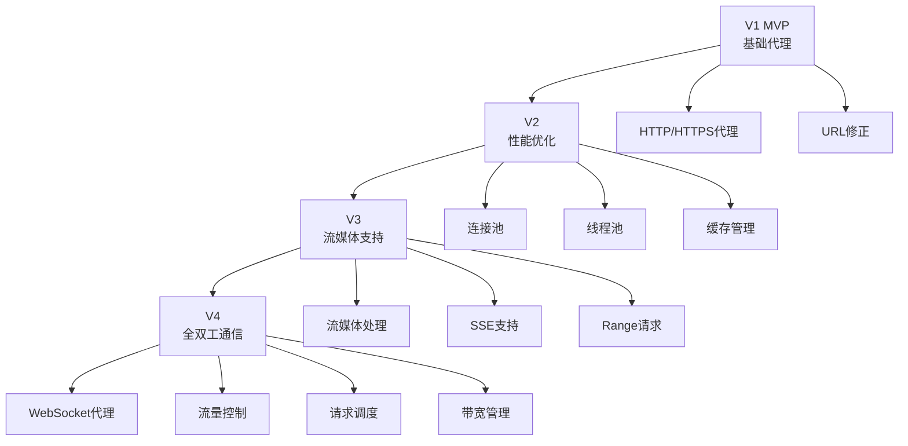

# SilkRoad-Next V4 版本详细开发文档

## 一、V4 版本概述

### 1.1 版本目标
V4 版本的核心目标是**全双工通信与流量控制**。在 V1 基础代理、V2 性能优化和 V3 流媒体支持的基础上，V4 引入 WebSocket 协议的完整支持，实现全双工通信能力，并引入流量控制器，实现请求调度与带宽管理。

### 1.2 新增模块清单
- **核心通信模块**：
  - `modules/websockets.py` - WebSocket 协议支持
  - `modules/controler.py` - 流量控制器

### 1.3 V1/V2/V3 到 V4 的演进路线



---

## 二、V1/V2/V3 与 V4 的衔接

### 2.1 V1/V2/V3 核心架构回顾

**V1 已实现**：
- ✅ 基础反向代理（HTTP/HTTPS）
- ✅ URL 修正引擎
- ✅ 静态文件服务器
- ✅ 日志系统
- ✅ 命令处理器
- ✅ UA 伪装
- ✅ Cookie 隔离

**V2 已实现**：
- ✅ 连接池
- ✅ 线程池
- ✅ 会话管理
- ✅ 缓存管理
- ✅ 黑名单拦截
- ✅ 脚本注入

**V3 已实现**：
- ✅ 流媒体处理
- ✅ SSE 支持
- ✅ Range 请求
- ✅ 大文件优化
- ✅ 流量整形

**V1/V2/V3 的局限**：
```python
# V3 的 WebSocket 升级准备（stream/others.py）
class StreamType(Enum):
    WEBSOCKET = "websocket"  # 已定义但未实现

# V3 只能识别 WebSocket 升级请求，但无法处理
async def identify_stream_type(self, headers: Dict, url: str) -> StreamType:
    # 检查 WebSocket 升级
    if headers.get('Upgrade', '').lower() == 'websocket':
        return StreamType.WEBSOCKET  # 返回类型但无处理器
```

**存在的问题**：
1. ❌ 无法建立 WebSocket 连接
2. ❌ 不支持 WebSocket 握手协议
3. ❌ 无法代理 WebSocket 消息帧
4. ❌ 缺乏流量控制机制
5. ❌ 没有请求调度能力
6. ❌ 无法管理带宽使用

### 2.2 V4 扩展点

#### 2.2.1 配置文件扩展

V4 需要在 `config.json` 中新增 WebSocket 和流量控制配置：

```json
{
  "websocket": {
    "enabled": true,
    "maxConnections": 500,
    "maxMessageSize": 1048576,
    "pingInterval": 30,
    "pongTimeout": 10,
    "compression": {
      "enabled": true,
      "level": 6
    },
    "extensions": {
      "permessage-deflate": true,
      "client-max-window-bits": 15,
      "server-max-window-bits": 15
    }
  },
  "trafficControl": {
    "enabled": true,
    "maxBandwidth": 104857600,
    "maxConnections": 5000,
    "requestQueue": {
      "enabled": true,
      "maxSize": 10000,
      "timeout": 30
    },
    "rateLimit": {
      "enabled": true,
      "requestsPerSecond": 1000,
      "burstSize": 100
    },
    "scheduling": {
      "algorithm": "priority",
      "priorities": {
        "websocket": 10,
        "media": 8,
        "sse": 7,
        "html": 5,
        "static": 3
      }
    }
  }
}
```

#### 2.2.2 ProxyServer 扩展

V4 在 V3 的 `ProxyServer` 基础上新增 WebSocket 和流量控制组件：

```python
# V4 的 ProxyServer 扩展
class ProxyServer:
    def __init__(self, host: str, port: int, config, logger):
        # V1 组件
        self.url_handler = URLHandler(config, logger)
        self.ua_handler = UAHandler()
        self.cookie_handler = CookieHandler()
        self.page_server = PageServer(config, logger)
        
        # V2 组件
        self.connection_pool = None
        self.thread_pool = None
        self.session_manager = None
        self.cache_manager = None
        self.blacklist_manager = None
        self.script_injector = None
        
        # V3 组件
        self.stream_handler = None
        self.media_handler = None
        self.sse_handler = None
        self.others_handler = None
        
        # V4 新增组件
        self.websocket_handler = None  # WebSocket 处理器
        self.traffic_controller = None  # 流量控制器
```

### 2.3 迁移策略

#### 2.3.1 渐进式集成

**阶段 1：流量控制框架搭建**
- 实现 `TrafficController` 基础框架
- 集成到 V1/V2/V3 的请求处理流程
- 保持向后兼容

**阶段 2：WebSocket 协议支持**
- 实现 `WebSocketHandler` 核心功能
- 支持 WebSocket 握手协议
- 实现消息帧的代理转发

**阶段 3：高级功能**
- WebSocket 扩展支持（压缩等）
- 流量调度优化
- 监控和统计

#### 2.3.2 向后兼容性

V4 保持与 V1/V2/V3 的完全兼容：

```python
# V4 的请求处理流程
async def _process_request(self, reader, writer):
    # ... V1/V2/V3 的请求解析 ...
    
    # V4: 流量控制检查
    if self.traffic_controller:
        await self.traffic_controller.acquire(request_info)
    
    try:
        # 检查是否为 WebSocket 升级请求
        if self._is_websocket_upgrade(headers):
            # V4: WebSocket 处理
            await self._handle_websocket_upgrade(writer, headers, target_url)
        # 检查是否为流式请求
        elif self._is_stream_request(headers, target_url):
            # V3: 流处理器
            await self._handle_stream_request(writer, method, target_url, headers, body)
        else:
            # V1/V2: 传统请求处理
            if self.connection_pool:
                await self._forward_request_with_pool(writer, method, target_url, headers, body)
            else:
                await self._forward_request(writer, method, target_url, headers, body)
    finally:
        # V4: 释放流量控制
        if self.traffic_controller:
            await self.traffic_controller.release(request_info)

def _is_websocket_upgrade(self, headers: dict) -> bool:
    """判断是否为 WebSocket 升级请求"""
    return (
        headers.get('Upgrade', '').lower() == 'websocket' and
        headers.get('Connection', '').lower() == 'upgrade' and
        'Sec-WebSocket-Key' in headers
    )
```

---

## 三、核心模块详细设计

### 3.1 WebSocket 协议支持模块 (websockets.py)

#### 3.1.1 设计目标
实现完整的 WebSocket 协议代理，支持握手、消息帧转发、连接状态维护、扩展协议（如压缩）等功能。

#### 3.1.2 WebSocket 协议基础

**WebSocket 握手流程**：

```
客户端 -> 代理服务器 -> 目标服务器
GET /chat HTTP/1.1
Host: example.com
Upgrade: websocket
Connection: Upgrade
Sec-WebSocket-Key: dGhlIHNhbXBsZSBub25jZQ==
Sec-WebSocket-Version: 13

目标服务器 -> 代理服务器 -> 客户端
HTTP/1.1 101 Switching Protocols
Upgrade: websocket
Connection: Upgrade
Sec-WebSocket-Accept: s3pPLMBiTxaQ9kYGzzhZRbK+xOo=
```

**WebSocket 消息帧格式**：

```
  0                   1                   2                   3
  0 1 2 3 4 5 6 7 8 9 0 1 2 3 4 5 6 7 8 9 0 1 2 3 4 5 6 7 8 9 0 1
 +-+-+-+-+-------+-+-------------+-------------------------------+
 |F|R|R|R| opcode|M| Payload len |    Extended payload length    |
 |I|S|S|S|  (4)  |A|     (7)     |             (16/64)           |
 |N|V|V|V|       |S|             |   (if payload len==126/127)   |
 | |1|2|3|       |K|             |                               |
 +-+-+-+-+-------+-+-------------+ - - - - - - - - - - - - - - - +
 |     Extended payload length continued, if payload len == 127  |
 + - - - - - - - - - - - - - - - +-------------------------------+
 |                               |Masking-key, if MASK set to 1  |
 +-------------------------------+-------------------------------+
 | Masking-key (continued)       |          Payload Data         |
 +-------------------------------- - - - - - - - - - - - - - - - +
```

#### 3.1.3 核心架构

```python
"""
WebSocket 协议支持模块

功能：
1. WebSocket 握手代理
2. 消息帧转发
3. 连接状态维护
4. 扩展协议支持（压缩等）
5. 心跳检测
6. 错误处理

作者: SilkRoad-Next Team
版本: 4.0.0
"""

import asyncio
import aiohttp
import hashlib
import base64
import struct
from typing import Optional, Dict, Any, List, Tuple
from enum import Enum, IntEnum
from dataclasses import dataclass, field
import time
import logging
import json


class OpCode(IntEnum):
    """WebSocket 操作码"""
    CONTINUATION = 0x0
    TEXT = 0x1
    BINARY = 0x2
    CLOSE = 0x8
    PING = 0x9
    PONG = 0xA


class ConnectionState(Enum):
    """WebSocket 连接状态"""
    CONNECTING = "connecting"
    OPEN = "open"
    CLOSING = "closing"
    CLOSED = "closed"


@dataclass
class WebSocketFrame:
    """WebSocket 消息帧"""
    fin: bool
    opcode: OpCode
    masked: bool
    payload: bytes
    rsv1: bool = False
    rsv2: bool = False
    rsv3: bool = False


@dataclass
class WebSocketContext:
    """WebSocket 连接上下文"""
    connection_id: str
    target_url: str
    state: ConnectionState
    client_writer: asyncio.StreamWriter
    target_ws: Optional[aiohttp.ClientWebSocketResponse] = None
    created_at: float = field(default_factory=time.time)
    last_activity: float = field(default_factory=time.time)
    messages_sent: int = 0
    messages_received: int = 0
    bytes_sent: int = 0
    bytes_received: int = 0
    metadata: Dict[str, Any] = field(default_factory=dict)


class WebSocketHandler:
    """
    WebSocket 协议处理器
    
    功能：
    1. WebSocket 握手代理
    2. 消息帧转发
    3. 连接状态管理
    4. 心跳检测
    5. 扩展协议支持
    """
    
    WEBSOCKET_GUID = "258EAFA5-E914-47DA-95CA-C5AB0DC85B11"
    
    def __init__(self, config, logger: Optional[logging.Logger] = None):
        """
        初始化 WebSocket 处理器
        
        Args:
            config: 配置管理器
            logger: 日志记录器
        """
        self.config = config
        self.logger = logger or logging.getLogger(__name__)
        
        # 配置参数
        self.max_connections = config.get('websocket.maxConnections', 500)
        self.max_message_size = config.get('websocket.maxMessageSize', 1048576)
        self.ping_interval = config.get('websocket.pingInterval', 30)
        self.pong_timeout = config.get('websocket.pongTimeout', 10)
        self.compression_enabled = config.get('websocket.compression.enabled', True)
        
        # 活跃连接管理
        self._connections: Dict[str, WebSocketContext] = {}
        self._lock = asyncio.Lock()
        
        # 统计信息
        self.stats = {
            'total_connections': 0,
            'active_connections': 0,
            'messages_sent': 0,
            'messages_received': 0,
            'bytes_sent': 0,
            'bytes_received': 0,
            'errors': 0
        }
        
        self.logger.info("WebSocketHandler 初始化完成")
    
    async def handle_upgrade(self,
                            client_writer: asyncio.StreamWriter,
                            headers: Dict[str, str],
                            target_url: str) -> None:
        """
        处理 WebSocket 升级请求
        
        Args:
            client_writer: 客户端写入器
            headers: 请求头
            target_url: 目标 URL
        """
        # 检查连接数限制
        async with self._lock:
            if len(self._connections) >= self.max_connections:
                self.logger.warning("WebSocket 连接数已达上限")
                await self._send_error(client_writer, 503, "Service Unavailable")
                return
        
        connection_id = self._generate_connection_id()
        
        try:
            # 1. 验证 WebSocket 握手
            if not self._validate_handshake(headers):
                await self._send_error(client_writer, 400, "Bad Request")
                return
            
            # 2. 与目标服务器建立 WebSocket 连接
            target_ws = await self._connect_to_target(target_url, headers)
            
            if target_ws is None:
                await self._send_error(client_writer, 502, "Bad Gateway")
                return
            
            # 3. 创建连接上下文
            context = WebSocketContext(
                connection_id=connection_id,
                target_url=target_url,
                state=ConnectionState.CONNECTING,
                client_writer=client_writer,
                target_ws=target_ws
            )
            
            # 4. 发送握手响应给客户端
            await self._send_handshake_response(client_writer, headers)
            
            # 5. 更新连接状态
            context.state = ConnectionState.OPEN
            
            async with self._lock:
                self._connections[connection_id] = context
                self.stats['total_connections'] += 1
                self.stats['active_connections'] += 1
            
            self.logger.info(f"WebSocket 连接建立: {connection_id} -> {target_url}")
            
            # 6. 启动双向消息转发
            await self._start_message_forwarding(context)
            
        except Exception as e:
            self.logger.error(f"WebSocket 升级失败: {e}")
            self.stats['errors'] += 1
            await self._send_error(client_writer, 500, "Internal Server Error")
    
    def _validate_handshake(self, headers: Dict[str, str]) -> bool:
        """
        验证 WebSocket 握手请求
        
        Args:
            headers: 请求头
            
        Returns:
            握手是否有效
        """
        # 检查必需的头
        required_headers = ['Upgrade', 'Connection', 'Sec-WebSocket-Key', 'Sec-WebSocket-Version']
        
        for header in required_headers:
            if header not in headers:
                self.logger.warning(f"缺少必需的 WebSocket 头: {header}")
                return False
        
        # 检查 Upgrade 头
        if headers['Upgrade'].lower() != 'websocket':
            self.logger.warning("无效的 Upgrade 头")
            return False
        
        # 检查 Connection 头
        if 'upgrade' not in headers['Connection'].lower():
            self.logger.warning("无效的 Connection 头")
            return False
        
        # 检查 WebSocket 版本
        if headers['Sec-WebSocket-Version'] != '13':
            self.logger.warning("不支持的 WebSocket 版本")
            return False
        
        return True
    
    async def _connect_to_target(self,
                                 target_url: str,
                                 headers: Dict[str, str]) -> Optional[aiohttp.ClientWebSocketResponse]:
        """
        与目标服务器建立 WebSocket 连接
        
        Args:
            target_url: 目标 URL
            headers: 请求头
            
        Returns:
            WebSocket 连接对象
        """
        try:
            # 转换 HTTP URL 为 WebSocket URL
            ws_url = self._convert_to_ws_url(target_url)
            
            # 准备请求头
            ws_headers = self._prepare_ws_headers(headers)
            
            # 创建客户端会话
            session = aiohttp.ClientSession()
            
            # 建立 WebSocket 连接
            ws = await session.ws_connect(
                ws_url,
                headers=ws_headers,
                max_msg_size=self.max_message_size,
                compress=self.compression_enabled,
                heartbeat=self.ping_interval
            )
            
            return ws
            
        except Exception as e:
            self.logger.error(f"连接目标服务器失败: {e}")
            return None
    
    def _convert_to_ws_url(self, http_url: str) -> str:
        """
        将 HTTP URL 转换为 WebSocket URL
        
        Args:
            http_url: HTTP URL
            
        Returns:
            WebSocket URL
        """
        if http_url.startswith('https://'):
            return http_url.replace('https://', 'wss://', 1)
        elif http_url.startswith('http://'):
            return http_url.replace('http://', 'ws://', 1)
        else:
            return http_url
    
    def _prepare_ws_headers(self, original_headers: Dict[str, str]) -> Dict[str, str]:
        """
        准备转发到目标服务器的 WebSocket 头
        
        Args:
            original_headers: 原始请求头
            
        Returns:
            转发的请求头
        """
        ws_headers = {}
        
        # 转发相关头
        forward_headers = [
            'Origin', 'Cookie', 'Authorization',
            'Sec-WebSocket-Protocol', 'Sec-WebSocket-Extensions'
        ]
        
        for header in forward_headers:
            if header in original_headers:
                ws_headers[header] = original_headers[header]
        
        return ws_headers
    
    async def _send_handshake_response(self,
                                      writer: asyncio.StreamWriter,
                                      request_headers: Dict[str, str]) -> None:
        """
        发送 WebSocket 握手响应
        
        Args:
            writer: 客户端写入器
            request_headers: 请求头
        """
        # 计算 Sec-WebSocket-Accept
        client_key = request_headers['Sec-WebSocket-Key']
        accept_key = self._compute_accept_key(client_key)
        
        # 构建响应
        response = "HTTP/1.1 101 Switching Protocols\r\n"
        response += "Upgrade: websocket\r\n"
        response += "Connection: Upgrade\r\n"
        response += f"Sec-WebSocket-Accept: {accept_key}\r\n"
        
        # 添加扩展支持
        if self.compression_enabled:
            response += "Sec-WebSocket-Extensions: permessage-deflate\r\n"
        
        response += "Via: SilkRoad-Next/4.0\r\n"
        response += "\r\n"
        
        # 发送响应
        writer.write(response.encode('utf-8'))
        await writer.drain()
    
    def _compute_accept_key(self, client_key: str) -> str:
        """
        计算 Sec-WebSocket-Accept 值
        
        Args:
            client_key: 客户端发送的 Sec-WebSocket-Key
            
        Returns:
            Accept 值
        """
        # 拼接 GUID
        key = client_key + self.WEBSOCKET_GUID
        
        # SHA-1 哈希
        sha1 = hashlib.sha1(key.encode('utf-8')).digest()
        
        # Base64 编码
        accept = base64.b64encode(sha1).decode('utf-8')
        
        return accept
    
    async def _start_message_forwarding(self, context: WebSocketContext) -> None:
        """
        启动双向消息转发
        
        Args:
            context: WebSocket 连接上下文
        """
        try:
            # 创建两个任务：客户端->目标 和 目标->客户端
            client_to_target = asyncio.create_task(
                self._forward_client_messages(context)
            )
            target_to_client = asyncio.create_task(
                self._forward_target_messages(context)
            )
            
            # 等待任一任务完成
            done, pending = await asyncio.wait(
                [client_to_target, target_to_client],
                return_when=asyncio.FIRST_COMPLETED
            )
            
            # 取消未完成的任务
            for task in pending:
                task.cancel()
                try:
                    await task
                except asyncio.CancelledError:
                    pass
            
        except Exception as e:
            self.logger.error(f"消息转发错误 [{context.connection_id}]: {e}")
            self.stats['errors'] += 1
        
        finally:
            # 关闭连接
            await self._close_connection(context)
    
    async def _forward_client_messages(self, context: WebSocketContext) -> None:
        """
        转发客户端消息到目标服务器
        
        Args:
            context: WebSocket 连接上下文
        """
        try:
            # 获取客户端读取器
            reader = context.client_writer._transport.get_extra_info('reader')
            
            while context.state == ConnectionState.OPEN:
                # 读取 WebSocket 帧
                frame = await self._read_frame(reader)
                
                if frame is None:
                    break
                
                # 更新活动时间
                context.last_activity = time.time()
                
                # 处理控制帧
                if frame.opcode == OpCode.CLOSE:
                    await self._handle_close_frame(context, frame)
                    break
                elif frame.opcode == OpCode.PING:
                    await self._handle_ping_frame(context, frame)
                    continue
                elif frame.opcode == OpCode.PONG:
                    await self._handle_pong_frame(context, frame)
                    continue
                
                # 转发数据帧到目标服务器
                if frame.opcode in [OpCode.TEXT, OpCode.BINARY, OpCode.CONTINUATION]:
                    if context.target_ws and not context.target_ws.closed:
                        if frame.opcode == OpCode.TEXT:
                            await context.target_ws.send_str(frame.payload.decode('utf-8'))
                        else:
                            await context.target_ws.send_bytes(frame.payload)
                        
                        # 更新统计
                        context.messages_sent += 1
                        context.bytes_sent += len(frame.payload)
                        self.stats['messages_sent'] += 1
                        self.stats['bytes_sent'] += len(frame.payload)
        
        except asyncio.CancelledError:
            pass
        except Exception as e:
            self.logger.error(f"客户端消息转发错误: {e}")
    
    async def _forward_target_messages(self, context: WebSocketContext) -> None:
        """
        转发目标服务器消息到客户端
        
        Args:
            context: WebSocket 连接上下文
        """
        try:
            while context.state == ConnectionState.OPEN:
                if context.target_ws is None or context.target_ws.closed:
                    break
                
                # 接收消息
                msg = await context.target_ws.receive()
                
                # 更新活动时间
                context.last_activity = time.time()
                
                # 处理不同类型的消息
                if msg.type == aiohttp.WSMsgType.TEXT:
                    # 文本消息
                    frame = WebSocketFrame(
                        fin=True,
                        opcode=OpCode.TEXT,
                        masked=False,
                        payload=msg.data.encode('utf-8')
                    )
                    await self._send_frame(context.client_writer, frame)
                    
                elif msg.type == aiohttp.WSMsgType.BINARY:
                    # 二进制消息
                    frame = WebSocketFrame(
                        fin=True,
                        opcode=OpCode.BINARY,
                        masked=False,
                        payload=msg.data
                    )
                    await self._send_frame(context.client_writer, frame)
                    
                elif msg.type == aiohttp.WSMsgType.PING:
                    # Ping 消息
                    frame = WebSocketFrame(
                        fin=True,
                        opcode=OpCode.PING,
                        masked=False,
                        payload=msg.data
                    )
                    await self._send_frame(context.client_writer, frame)
                    
                elif msg.type == aiohttp.WSMsgType.PONG:
                    # Pong 消息
                    frame = WebSocketFrame(
                        fin=True,
                        opcode=OpCode.PONG,
                        masked=False,
                        payload=msg.data
                    )
                    await self._send_frame(context.client_writer, frame)
                    
                elif msg.type == aiohttp.WSMsgType.CLOSE:
                    # 关闭消息
                    await self._handle_close_frame(context, None)
                    break
                
                elif msg.type == aiohttp.WSMsgType.ERROR:
                    # 错误
                    self.logger.error(f"目标服务器 WebSocket 错误: {context.target_ws.exception()}")
                    break
                
                # 更新统计
                context.messages_received += 1
                context.bytes_received += len(msg.data)
                self.stats['messages_received'] += 1
                self.stats['bytes_received'] += len(msg.data)
        
        except asyncio.CancelledError:
            pass
        except Exception as e:
            self.logger.error(f"目标服务器消息转发错误: {e}")
    
    async def _read_frame(self, reader: asyncio.StreamReader) -> Optional[WebSocketFrame]:
        """
        读取 WebSocket 帧
        
        Args:
            reader: 流读取器
            
        Returns:
            WebSocket 帧对象
        """
        try:
            # 读取前两个字节
            header = await reader.readexactly(2)
            byte1, byte2 = struct.unpack('!BB', header)
            
            # 解析第一个字节
            fin = (byte1 & 0x80) != 0
            rsv1 = (byte1 & 0x40) != 0
            rsv2 = (byte1 & 0x20) != 0
            rsv3 = (byte1 & 0x10) != 0
            opcode = OpCode(byte1 & 0x0F)
            
            # 解析第二个字节
            masked = (byte2 & 0x80) != 0
            payload_len = byte2 & 0x7F
            
            # 读取扩展长度
            if payload_len == 126:
                ext_len = await reader.readexactly(2)
                payload_len = struct.unpack('!H', ext_len)[0]
            elif payload_len == 127:
                ext_len = await reader.readexactly(8)
                payload_len = struct.unpack('!Q', ext_len)[0]
            
            # 检查消息大小
            if payload_len > self.max_message_size:
                self.logger.warning(f"消息大小超过限制: {payload_len} > {self.max_message_size}")
                return None
            
            # 读取掩码
            mask_key = None
            if masked:
                mask_key = await reader.readexactly(4)
            
            # 读取负载数据
            payload = await reader.readexactly(payload_len)
            
            # 解码掩码
            if masked and mask_key:
                payload = self._apply_mask(payload, mask_key)
            
            return WebSocketFrame(
                fin=fin,
                opcode=opcode,
                masked=masked,
                payload=payload,
                rsv1=rsv1,
                rsv2=rsv2,
                rsv3=rsv3
            )
            
        except asyncio.IncompleteReadError:
            return None
        except Exception as e:
            self.logger.error(f"读取 WebSocket 帧失败: {e}")
            return None
    
    async def _send_frame(self,
                         writer: asyncio.StreamWriter,
                         frame: WebSocketFrame) -> None:
        """
        发送 WebSocket 帧
        
        Args:
            writer: 流写入器
            frame: WebSocket 帧对象
        """
        try:
            # 构建帧头
            byte1 = frame.opcode
            
            if frame.fin:
                byte1 |= 0x80
            if frame.rsv1:
                byte1 |= 0x40
            if frame.rsv2:
                byte1 |= 0x20
            if frame.rsv3:
                byte1 |= 0x10
            
            # 构建长度字段
            payload_len = len(frame.payload)
            
            if payload_len < 126:
                byte2 = payload_len
                header = struct.pack('!BB', byte1, byte2)
            elif payload_len < 65536:
                byte2 = 126
                header = struct.pack('!BBH', byte1, byte2, payload_len)
            else:
                byte2 = 127
                header = struct.pack('!BBQ', byte1, byte2, payload_len)
            
            # 发送帧
            writer.write(header + frame.payload)
            await writer.drain()
            
        except Exception as e:
            self.logger.error(f"发送 WebSocket 帧失败: {e}")
    
    def _apply_mask(self, data: bytes, mask: bytes) -> bytes:
        """
        应用掩码
        
        Args:
            data: 原始数据
            mask: 掩码
            
        Returns:
            掩码后的数据
        """
        masked = bytearray(len(data))
        for i in range(len(data)):
            masked[i] = data[i] ^ mask[i % 4]
        return bytes(masked)
    
    async def _handle_close_frame(self,
                                  context: WebSocketContext,
                                  frame: Optional[WebSocketFrame]) -> None:
        """
        处理关闭帧
        
        Args:
            context: WebSocket 连接上下文
            frame: 关闭帧
        """
        context.state = ConnectionState.CLOSING
        
        # 发送关闭帧给对方
        if frame:
            # 回应关闭帧
            close_frame = WebSocketFrame(
                fin=True,
                opcode=OpCode.CLOSE,
                masked=False,
                payload=frame.payload
            )
            await self._send_frame(context.client_writer, close_frame)
        
        # 关闭目标服务器连接
        if context.target_ws and not context.target_ws.closed:
            await context.target_ws.close()
    
    async def _handle_ping_frame(self,
                                context: WebSocketContext,
                                frame: WebSocketFrame) -> None:
        """
        处理 Ping 帧
        
        Args:
            context: WebSocket 连接上下文
            frame: Ping 帧
        """
        # 回应 Pong 帧
        pong_frame = WebSocketFrame(
            fin=True,
            opcode=OpCode.PONG,
            masked=False,
            payload=frame.payload
        )
        await self._send_frame(context.client_writer, pong_frame)
    
    async def _handle_pong_frame(self,
                                context: WebSocketContext,
                                frame: WebSocketFrame) -> None:
        """
        处理 Pong 帧
        
        Args:
            context: WebSocket 连接上下文
            frame: Pong 帧
        """
        # 更新活动时间
        context.last_activity = time.time()
    
    async def _close_connection(self, context: WebSocketContext) -> None:
        """
        关闭 WebSocket 连接
        
        Args:
            context: WebSocket 连接上下文
        """
        context.state = ConnectionState.CLOSED
        
        # 关闭客户端连接
        try:
            context.client_writer.close()
            await context.client_writer.wait_closed()
        except Exception:
            pass
        
        # 关闭目标服务器连接
        if context.target_ws and not context.target_ws.closed:
            try:
                await context.target_ws.close()
            except Exception:
                pass
        
        # 移除连接记录
        async with self._lock:
            if context.connection_id in self._connections:
                del self._connections[context.connection_id]
            self.stats['active_connections'] -= 1
        
        self.logger.info(
            f"WebSocket 连接关闭: {context.connection_id} | "
            f"发送={context.messages_sent}条/{context.bytes_sent}字节 | "
            f"接收={context.messages_received}条/{context.bytes_received}字节"
        )
    
    async def _send_error(self,
                         writer: asyncio.StreamWriter,
                         status_code: int,
                         message: str) -> None:
        """
        发送错误响应
        
        Args:
            writer: 客户端写入器
            status_code: 状态码
            message: 错误消息
        """
        response = f"HTTP/1.1 {status_code} {message}\r\n"
        response += "Content-Type: text/plain\r\n"
        response += f"Content-Length: {len(message)}\r\n"
        response += "\r\n"
        response += message
        
        writer.write(response.encode('utf-8'))
        await writer.drain()
    
    def _generate_connection_id(self) -> str:
        """生成唯一连接 ID"""
        import uuid
        return str(uuid.uuid4())[:8]
    
    async def get_active_connections(self) -> List[WebSocketContext]:
        """获取所有活跃连接"""
        async with self._lock:
            return list(self._connections.values())
    
    async def close_connection(self, connection_id: str) -> bool:
        """
        关闭指定连接
        
        Args:
            connection_id: 连接 ID
            
        Returns:
            是否成功关闭
        """
        async with self._lock:
            if connection_id in self._connections:
                context = self._connections[connection_id]
                context.state = ConnectionState.CLOSING
                return True
            return False
    
    def get_stats(self) -> dict:
        """获取 WebSocket 统计信息"""
        return {
            **self.stats,
            'active_connections_count': len(self._connections)
        }
```

#### 3.1.4 使用示例

**示例 1：基础 WebSocket 代理**

```python
import asyncio
from modules.cfg import ConfigManager
from modules.logging import Logger
from modules.websockets import WebSocketHandler

async def example_websocket_proxy():
    """WebSocket 代理示例"""
    # 初始化
    config = ConfigManager()
    await config.load()
    logger = Logger(config)
    
    ws_handler = WebSocketHandler(config, logger.logger)
    
    # 模拟客户端连接
    async def handle_client():
        # 创建客户端连接
        reader, writer = await asyncio.open_connection('127.0.0.1', 8080)
        
        # 发送 WebSocket 握手请求
        request = (
            "GET /chat HTTP/1.1\r\n"
            "Host: example.com\r\n"
            "Upgrade: websocket\r\n"
            "Connection: Upgrade\r\n"
            "Sec-WebSocket-Key: dGhlIHNhbXBsZSBub25jZQ==\r\n"
            "Sec-WebSocket-Version: 13\r\n"
            "\r\n"
        )
        
        writer.write(request.encode('utf-8'))
        await writer.drain()
        
        # 接收握手响应
        response = await reader.read(1024)
        print(f"握手响应:\n{response.decode('utf-8')}")
        
        # WebSocket 连接已建立，可以发送消息
        # ...
    
    await handle_client()

# 运行示例
asyncio.run(example_websocket_proxy())
```

**示例 2：集成到 ProxyServer**

```python
# modules/proxy.py - V4 扩展
class ProxyServer:
    def __init__(self, host: str, port: int, config, logger):
        # ... V1/V2/V3 初始化 ...
        
        # V4: 初始化 WebSocket 处理器
        if config.get('websocket.enabled', False):
            from modules.websockets import WebSocketHandler
            
            self.websocket_handler = WebSocketHandler(config, logger)
            logger.info("WebSocket 处理器已启用")
    
    async def _process_request(self, reader, writer):
        """处理请求（V1 + V2 + V3 + V4）"""
        # ... 请求解析 ...
        
        # V4: 检查是否为 WebSocket 升级请求
        if self._is_websocket_upgrade(headers):
            # 使用 WebSocket 处理器
            await self.websocket_handler.handle_upgrade(
                writer, headers, target_url
            )
        # V3: 检查是否为流式请求
        elif self._is_stream_request(headers, target_url):
            await self._handle_stream_request(
                writer, method, target_url, headers, body
            )
        else:
            # V1/V2: 传统请求处理
            if self.connection_pool:
                await self._forward_request_with_pool(
                    writer, method, target_url, headers, body
                )
            else:
                await self._forward_request(
                    writer, method, target_url, headers, body
                )
    
    def _is_websocket_upgrade(self, headers: dict) -> bool:
        """判断是否为 WebSocket 升级请求"""
        return (
            headers.get('Upgrade', '').lower() == 'websocket' and
            headers.get('Connection', '').lower() == 'upgrade' and
            'Sec-WebSocket-Key' in headers
        )
```

---

### 3.2 流量控制器模块 (controler.py)

#### 3.2.1 设计目标
实现请求调度、带宽管理、流量整形、优先级队列等功能，确保系统在高负载下的稳定性和公平性。

#### 3.2.2 核心架构

```python
"""
流量控制器模块

功能：
1. 请求调度
2. 带宽管理
3. 流量整形
4. 优先级队列
5. 连接限制
6. 速率限制

作者: SilkRoad-Next Team
版本: 4.0.0
"""

import asyncio
import time
from typing import Optional, Dict, Any, List, Callable
from enum import Enum
from dataclasses import dataclass, field
from collections import deque
import logging


class RequestPriority(Enum):
    """请求优先级"""
    CRITICAL = 10   # 关键请求（WebSocket、控制命令）
    HIGH = 8        # 高优先级（媒体流、SSE）
    NORMAL = 5      # 普通优先级（HTML、API）
    LOW = 3         # 低优先级（静态资源）
    BACKGROUND = 1  # 后台任务


@dataclass
class RequestInfo:
    """请求信息"""
    request_id: str
    url: str
    method: str
    priority: RequestPriority
    content_type: str
    client_ip: str
    timestamp: float = field(default_factory=time.time)
    size: int = 0
    metadata: Dict[str, Any] = field(default_factory=dict)


@dataclass
class BandwidthUsage:
    """带宽使用记录"""
    timestamp: float
    bytes_sent: int
    bytes_received: int


class TrafficController:
    """
    流量控制器
    
    功能：
    1. 请求调度
    2. 带宽管理
    3. 流量整形
    4. 优先级队列
    """
    
    def __init__(self, config, logger: Optional[logging.Logger] = None):
        """
        初始化流量控制器
        
        Args:
            config: 配置管理器
            logger: 日志记录器
        """
        self.config = config
        self.logger = logger or logging.getLogger(__name__)
        
        # 配置参数
        self.max_bandwidth = config.get('trafficControl.maxBandwidth', 104857600)  # 100MB/s
        self.max_connections = config.get('trafficControl.maxConnections', 5000)
        self.request_queue_enabled = config.get('trafficControl.requestQueue.enabled', True)
        self.queue_max_size = config.get('trafficControl.requestQueue.maxSize', 10000)
        self.queue_timeout = config.get('trafficControl.requestQueue.timeout', 30)
        self.rate_limit_enabled = config.get('trafficControl.rateLimit.enabled', True)
        self.requests_per_second = config.get('trafficControl.rateLimit.requestsPerSecond', 1000)
        self.burst_size = config.get('trafficControl.rateLimit.burstSize', 100)
        
        # 请求队列（按优先级）
        self._request_queues: Dict[RequestPriority, deque] = {
            priority: deque() for priority in RequestPriority
        }
        
        # 活跃连接
        self._active_connections: Dict[str, RequestInfo] = {}
        
        # 带宽使用记录
        self._bandwidth_history: deque = deque(maxlen=60)  # 保留最近60秒
        
        # 速率限制令牌桶
        self._tokens = self.burst_size
        self._last_token_update = time.time()
        
        # 锁机制
        self._lock = asyncio.Lock()
        self._queue_lock = asyncio.Lock()
        
        # 统计信息
        self.stats = {
            'total_requests': 0,
            'queued_requests': 0,
            'rejected_requests': 0,
            'active_connections': 0,
            'bytes_sent': 0,
            'bytes_received': 0,
            'rate_limited': 0,
            'queue_timeouts': 0
        }
        
        self.logger.info("TrafficController 初始化完成")
    
    async def acquire(self, request_info: RequestInfo) -> bool:
        """
        获取流量控制许可
        
        Args:
            request_info: 请求信息
            
        Returns:
            是否获取成功
        """
        async with self._lock:
            # 1. 检查连接数限制
            if len(self._active_connections) >= self.max_connections:
                self.logger.warning(f"连接数已达上限: {len(self._active_connections)}/{self.max_connections}")
                self.stats['rejected_requests'] += 1
                return False
            
            # 2. 检查速率限制
            if self.rate_limit_enabled and not await self._check_rate_limit():
                self.logger.debug(f"速率限制: {request_info.url}")
                self.stats['rate_limited'] += 1
                
                # 如果启用了请求队列，将请求加入队列
                if self.request_queue_enabled:
                    return await self._enqueue_request(request_info)
                else:
                    self.stats['rejected_requests'] += 1
                    return False
            
            # 3. 检查带宽限制
            if not await self._check_bandwidth():
                self.logger.debug(f"带宽限制: {request_info.url}")
                
                # 如果启用了请求队列，将请求加入队列
                if self.request_queue_enabled:
                    return await self._enqueue_request(request_info)
                else:
                    self.stats['rejected_requests'] += 1
                    return False
            
            # 4. 注册活跃连接
            self._active_connections[request_info.request_id] = request_info
            self.stats['total_requests'] += 1
            self.stats['active_connections'] = len(self._active_connections)
            
            return True
    
    async def release(self, request_info: RequestInfo) -> None:
        """
        释放流量控制许可
        
        Args:
            request_info: 请求信息
        """
        async with self._lock:
            # 移除活跃连接
            if request_info.request_id in self._active_connections:
                del self._active_connections[request_info.request_id]
                self.stats['active_connections'] = len(self._active_connections)
            
            # 更新带宽使用记录
            if request_info.size > 0:
                self._bandwidth_history.append(BandwidthUsage(
                    timestamp=time.time(),
                    bytes_sent=request_info.size,
                    bytes_received=0
                ))
                self.stats['bytes_sent'] += request_info.size
    
    async def _check_rate_limit(self) -> bool:
        """
        检查速率限制（令牌桶算法）
        
        Returns:
            是否通过速率限制
        """
        current_time = time.time()
        elapsed = current_time - self._last_token_update
        
        # 补充令牌
        self._tokens = min(
            self.burst_size,
            self._tokens + elapsed * self.requests_per_second
        )
        self._last_token_update = current_time
        
        # 检查是否有可用令牌
        if self._tokens >= 1:
            self._tokens -= 1
            return True
        
        return False
    
    async def _check_bandwidth(self) -> bool:
        """
        检查带宽限制
        
        Returns:
            是否通过带宽限制
        """
        if not self._bandwidth_history:
            return True
        
        # 计算最近1秒的带宽使用
        current_time = time.time()
        recent_usage = [
            usage for usage in self._bandwidth_history
            if current_time - usage.timestamp <= 1.0
        ]
        
        total_bytes = sum(usage.bytes_sent + usage.bytes_received for usage in recent_usage)
        current_bandwidth = total_bytes  # bytes/s
        
        return current_bandwidth < self.max_bandwidth
    
    async def _enqueue_request(self, request_info: RequestInfo) -> bool:
        """
        将请求加入队列
        
        Args:
            request_info: 请求信息
            
        Returns:
            是否成功加入队列
        """
        async with self._queue_lock:
            # 检查队列大小
            total_queued = sum(len(queue) for queue in self._request_queues.values())
            
            if total_queued >= self.queue_max_size:
                self.logger.warning(f"请求队列已满: {total_queued}/{self.queue_max_size}")
                self.stats['rejected_requests'] += 1
                return False
            
            # 加入对应优先级的队列
            self._request_queues[request_info.priority].append(request_info)
            self.stats['queued_requests'] += 1
            
            self.logger.debug(
                f"请求加入队列: {request_info.url} | "
                f"优先级={request_info.priority.name} | "
                f"队列长度={len(self._request_queues[request_info.priority])}"
            )
            
            return True
    
    async def get_next_request(self) -> Optional[RequestInfo]:
        """
        从队列获取下一个请求（优先级调度）
        
        Returns:
            下一个请求信息
        """
        async with self._queue_lock:
            # 按优先级从高到低检查队列
            for priority in sorted(RequestPriority, key=lambda p: p.value, reverse=True):
                if self._request_queues[priority]:
                    request_info = self._request_queues[priority].popleft()
                    
                    # 检查是否超时
                    if time.time() - request_info.timestamp > self.queue_timeout:
                        self.stats['queue_timeouts'] += 1
                        continue
                    
                    return request_info
            
            return None
    
    def determine_priority(self, request_info: RequestInfo) -> RequestPriority:
        """
        确定请求优先级
        
        Args:
            request_info: 请求信息
            
        Returns:
            请求优先级
        """
        # 根据配置的优先级映射
        priority_map = self.config.get('trafficControl.scheduling.priorities', {})
        
        # 1. WebSocket 请求
        if 'websocket' in request_info.metadata.get('upgrade', '').lower():
            return RequestPriority.CRITICAL
        
        # 2. 媒体流
        if any(media_type in request_info.content_type.lower() 
               for media_type in ['video/', 'audio/']):
            return RequestPriority.HIGH
        
        # 3. SSE
        if 'text/event-stream' in request_info.content_type.lower():
            return RequestPriority.HIGH
        
        # 4. HTML
        if 'text/html' in request_info.content_type.lower():
            return RequestPriority.NORMAL
        
        # 5. 静态资源
        if any(static_type in request_info.content_type.lower()
               for static_type in ['image/', 'text/css', 'application/javascript']):
            return RequestPriority.LOW
        
        # 6. 默认
        return RequestPriority.NORMAL
    
    async def get_stats(self) -> dict:
        """获取流量控制统计信息"""
        async with self._lock:
            queue_sizes = {
                priority.name: len(queue)
                for priority, queue in self._request_queues.items()
            }
            
            return {
                **self.stats,
                'queue_sizes': queue_sizes,
                'available_tokens': self._tokens,
                'bandwidth_usage': await self._get_current_bandwidth()
            }
    
    async def _get_current_bandwidth(self) -> int:
        """获取当前带宽使用"""
        if not self._bandwidth_history:
            return 0
        
        current_time = time.time()
        recent_usage = [
            usage for usage in self._bandwidth_history
            if current_time - usage.timestamp <= 1.0
        ]
        
        return sum(usage.bytes_sent + usage.bytes_received for usage in recent_usage)
    
    async def start_scheduler(self):
        """启动请求调度器"""
        while True:
            await asyncio.sleep(0.1)  # 每100ms检查一次
            
            # 检查是否有可用资源
            if len(self._active_connections) < self.max_connections:
                # 获取下一个请求
                request_info = await self.get_next_request()
                
                if request_info:
                    # 尝试获取许可
                    if await self.acquire(request_info):
                        self.logger.debug(f"调度请求: {request_info.url}")
                        # 触发请求处理
                        # 这里可以触发回调或事件


class BandwidthManager:
    """
    带宽管理器
    
    功能：
    1. 实时带宽监控
    2. 带宽分配
    3. 流量整形
    """
    
    def __init__(self, max_bandwidth: int, logger: Optional[logging.Logger] = None):
        """
        初始化带宽管理器
        
        Args:
            max_bandwidth: 最大带宽（bytes/s）
            logger: 日志记录器
        """
        self.max_bandwidth = max_bandwidth
        self.logger = logger or logging.getLogger(__name__)
        
        # 当前带宽使用
        self._current_usage = 0
        self._last_update = time.time()
        
        # 带宽分配
        self._allocations: Dict[str, int] = {}
        
        # 锁机制
        self._lock = asyncio.Lock()
    
    async def allocate(self, connection_id: str, requested_bandwidth: int) -> int:
        """
        分配带宽
        
        Args:
            connection_id: 连接 ID
            requested_bandwidth: 请求的带宽
            
        Returns:
            实际分配的带宽
        """
        async with self._lock:
            # 计算可用带宽
            available = self.max_bandwidth - self._current_usage
            
            # 分配带宽
            allocated = min(requested_bandwidth, available)
            
            if allocated > 0:
                self._allocations[connection_id] = allocated
                self._current_usage += allocated
            
            return allocated
    
    async def release(self, connection_id: str) -> None:
        """
        释放带宽
        
        Args:
            connection_id: 连接 ID
        """
        async with self._lock:
            if connection_id in self._allocations:
                self._current_usage -= self._allocations[connection_id]
                del self._allocations[connection_id]
    
    async def update_usage(self, connection_id: str, actual_usage: int) -> None:
        """
        更新带宽使用
        
        Args:
            connection_id: 连接 ID
            actual_usage: 实际使用量
        """
        async with self._lock:
            if connection_id in self._allocations:
                # 调整分配
                old_allocation = self._allocations[connection_id]
                self._current_usage -= old_allocation
                self._current_usage += actual_usage
                self._allocations[connection_id] = actual_usage
    
    def get_usage(self) -> dict:
        """获取带宽使用情况"""
        return {
            'max_bandwidth': self.max_bandwidth,
            'current_usage': self._current_usage,
            'available': self.max_bandwidth - self._current_usage,
            'utilization': (self._current_usage / self.max_bandwidth * 100) if self.max_bandwidth > 0 else 0,
            'allocations': dict(self._allocations)
        }
```

#### 3.2.3 使用示例

**示例 1：基础流量控制**

```python
import asyncio
from modules.cfg import ConfigManager
from modules.logging import Logger
from modules.controler import TrafficController, RequestInfo, RequestPriority

async def example_traffic_control():
    """流量控制示例"""
    # 初始化
    config = ConfigManager()
    await config.load()
    logger = Logger(config)
    
    traffic_controller = TrafficController(config, logger.logger)
    
    # 模拟请求
    for i in range(10):
        request_info = RequestInfo(
            request_id=f"req-{i}",
            url=f"http://example.com/page{i}",
            method="GET",
            priority=RequestPriority.NORMAL,
            content_type="text/html",
            client_ip="192.168.1.100"
        )
        
        # 获取许可
        if await traffic_controller.acquire(request_info):
            print(f"请求 {i} 获取许可成功")
            
            # 模拟处理请求
            await asyncio.sleep(0.1)
            
            # 释放许可
            await traffic_controller.release(request_info)
        else:
            print(f"请求 {i} 被拒绝")
    
    # 获取统计信息
    stats = traffic_controller.get_stats()
    print(f"统计信息: {stats}")

# 运行示例
asyncio.run(example_traffic_control())
```

**示例 2：集成到 ProxyServer**

```python
# modules/proxy.py - V4 扩展
class ProxyServer:
    def __init__(self, host: str, port: int, config, logger):
        # ... V1/V2/V3 初始化 ...
        
        # V4: 初始化流量控制器
        if config.get('trafficControl.enabled', False):
            from modules.controler import TrafficController
            
            self.traffic_controller = TrafficController(config, logger)
            logger.info("流量控制器已启用")
    
    async def _process_request(self, reader, writer):
        """处理请求（V1 + V2 + V3 + V4）"""
        # ... 请求解析 ...
        
        # 创建请求信息
        request_info = RequestInfo(
            request_id=self._generate_request_id(),
            url=target_url,
            method=method,
            priority=self.traffic_controller.determine_priority(
                RequestInfo(
                    request_id='',
                    url=target_url,
                    method=method,
                    priority=RequestPriority.NORMAL,
                    content_type=headers.get('Content-Type', ''),
                    client_ip=client_ip,
                    metadata={'upgrade': headers.get('Upgrade', '')}
                )
            ),
            content_type=headers.get('Content-Type', ''),
            client_ip=client_ip,
            metadata={'upgrade': headers.get('Upgrade', '')}
        )
        
        # V4: 流量控制
        if self.traffic_controller:
            if not await self.traffic_controller.acquire(request_info):
                self.logger.warning(f"请求被流量控制拒绝: {target_url}")
                await self._send_error(writer, 503, "Service Unavailable")
                return
        
        try:
            # V4: 检查是否为 WebSocket 升级请求
            if self._is_websocket_upgrade(headers):
                await self.websocket_handler.handle_upgrade(
                    writer, headers, target_url
                )
            # V3: 检查是否为流式请求
            elif self._is_stream_request(headers, target_url):
                await self._handle_stream_request(
                    writer, method, target_url, headers, body
                )
            else:
                # V1/V2: 传统请求处理
                if self.connection_pool:
                    await self._forward_request_with_pool(
                        writer, method, target_url, headers, body
                    )
                else:
                    await self._forward_request(
                        writer, method, target_url, headers, body
                    )
        
        finally:
            # V4: 释放流量控制
            if self.traffic_controller:
                await self.traffic_controller.release(request_info)
```

**示例 3：优先级调度**

```python
async def example_priority_scheduling():
    """优先级调度示例"""
    from modules.controler import TrafficController, RequestInfo, RequestPriority
    
    # 创建流量控制器
    traffic_controller = TrafficController(config, logger)
    
    # 启动调度器
    asyncio.create_task(traffic_controller.start_scheduler())
    
    # 模拟不同优先级的请求
    requests = [
        RequestInfo(
            request_id="ws-1",
            url="ws://example.com/chat",
            method="GET",
            priority=RequestPriority.CRITICAL,
            content_type="",
            client_ip="192.168.1.100",
            metadata={'upgrade': 'websocket'}
        ),
        RequestInfo(
            request_id="video-1",
            url="http://example.com/video.mp4",
            method="GET",
            priority=RequestPriority.HIGH,
            content_type="video/mp4",
            client_ip="192.168.1.101"
        ),
        RequestInfo(
            request_id="html-1",
            url="http://example.com/index.html",
            method="GET",
            priority=RequestPriority.NORMAL,
            content_type="text/html",
            client_ip="192.168.1.102"
        ),
        RequestInfo(
            request_id="image-1",
            url="http://example.com/image.jpg",
            method="GET",
            priority=RequestPriority.LOW,
            content_type="image/jpeg",
            client_ip="192.168.1.103"
        )
    ]
    
    # 加入队列
    for request in requests:
        await traffic_controller.acquire(request)
    
    # 获取统计信息
    stats = await traffic_controller.get_stats()
    print(f"队列状态: {stats['queue_sizes']}")

# 运行示例
asyncio.run(example_priority_scheduling())
```

---

## 四、集成与测试

### 4.1 V4 模块集成到 V1/V2/V3

#### 4.1.1 主程序扩展

```python
# SilkRoad.py - V4 扩展
class SilkRoad:
    def __init__(self):
        # V1 组件
        self.config = ConfigManager()
        self.logger: Optional[Logger] = None
        self.proxy_server: Optional[ProxyServer] = None
        self.command_handler: Optional[CommandHandler] = None
        self.shutdown_event = asyncio.Event()
        
        # V2 组件
        self.connection_pool = None
        self.thread_pool = None
        self.session_manager = None
        self.cache_manager = None
        self.blacklist_manager = None
        self.script_injector = None
        
        # V3 组件
        self.stream_handler = None
        self.media_handler = None
        self.sse_handler = None
        self.others_handler = None
        
        # V4 新增组件
        self.websocket_handler = None
        self.traffic_controller = None
    
    async def initialize(self) -> None:
        """初始化所有模块（V1 + V2 + V3 + V4）"""
        try:
            # ========== V1/V2/V3 初始化 ==========
            # ... V1/V2/V3 初始化代码 ...
            
            # ========== V4 初始化 ==========
            # 13. 初始化 WebSocket 处理器
            print("[13/15] 初始化 WebSocket 处理器...")
            if self.config.get('websocket.enabled', False):
                from modules.websockets import WebSocketHandler
                
                self.websocket_handler = WebSocketHandler(self.config, self.logger.logger)
                self.logger.info("WebSocket 处理器已启用")
            
            # 14. 初始化流量控制器
            print("[14/15] 初始化流量控制器...")
            if self.config.get('trafficControl.enabled', False):
                from modules.controler import TrafficController
                
                self.traffic_controller = TrafficController(self.config, self.logger.logger)
                
                # 启动调度器
                asyncio.create_task(self.traffic_controller.start_scheduler())
                self.logger.info("流量控制器已启用")
            
            # ========== 创建代理服务器 ==========
            print("[15/15] 创建代理服务器...")
            proxy_host = self.config.get('server.proxy.host', '0.0.0.0')
            proxy_port = self.config.get('server.proxy.port', 8080)
            
            self.proxy_server = ProxyServer(
                host=proxy_host,
                port=proxy_port,
                config=self.config,
                logger=self.logger
            )
            
            # 注入 V2/V3/V4 模块到代理服务器
            # V2 模块
            self.proxy_server.connection_pool = self.connection_pool
            self.proxy_server.thread_pool = self.thread_pool
            self.proxy_server.session_manager = self.session_manager
            self.proxy_server.cache_manager = self.cache_manager
            self.proxy_server.blacklist_manager = self.blacklist_manager
            self.proxy_server.script_injector = self.script_injector
            
            # V3 模块
            self.proxy_server.stream_handler = self.stream_handler
            self.proxy_server.media_handler = self.media_handler
            self.proxy_server.sse_handler = self.sse_handler
            self.proxy_server.others_handler = self.others_handler
            
            # V4 模块
            self.proxy_server.websocket_handler = self.websocket_handler
            self.proxy_server.traffic_controller = self.traffic_controller
            
            # 创建命令处理器
            self.command_handler = CommandHandler(
                proxy_server=self.proxy_server,
                config=self.config,
                logger=self.logger
            )
            self.proxy_server.command_handler = self.command_handler
            
            # 设置优雅退出
            GracefulExit.setup(self.shutdown_event, self.logger)
            
            # 初始化完成
            print()
            print("=" * 60)
            print("  初始化完成！")
            print("=" * 60)
            print()
            
            self.logger.info("所有模块初始化完成（V1 + V2 + V3 + V4）")
            
        except Exception as e:
            error_msg = f"初始化失败: {e}"
            if self.logger:
                self.logger.error(error_msg, exception=e)
            else:
                print(f"[错误] {error_msg}")
            raise
    
    async def shutdown(self):
        """优雅关闭（V1 + V2 + V3 + V4）"""
        self.logger.info("开始优雅关闭...")
        
        try:
            # 关闭 V4 模块
            if self.websocket_handler:
                self.logger.info("[1/9] 关闭 WebSocket 连接...")
                connections = await self.websocket_handler.get_active_connections()
                for conn in connections:
                    await self.websocket_handler.close_connection(conn.connection_id)
            
            if self.traffic_controller:
                self.logger.info("[2/9] 停止流量控制器...")
                # 流量控制器无需特殊关闭
            
            # 关闭 V3 模块
            if self.stream_handler:
                self.logger.info("[3/9] 关闭流处理器...")
                active_streams = await self.stream_handler.get_active_streams()
                for stream_id in active_streams:
                    await self.stream_handler.close_stream(stream_id)
            
            # 关闭 V2 模块
            if self.connection_pool:
                self.logger.info("[4/9] 关闭连接池...")
                await self.connection_pool.close_all()
            
            if self.thread_pool:
                self.logger.info("[5/9] 关闭线程池...")
                self.thread_pool.shutdown()
            
            if self.session_manager:
                self.logger.info("[6/9] 保存会话数据...")
                await self.session_manager.save_to_file('sessions_backup.json')
            
            if self.cache_manager:
                self.logger.info("[7/9] 清理缓存...")
                await self.cache_manager.clear_all()
            
            # 关闭 V1 模块
            if self.proxy_server:
                self.logger.info("[8/9] 停止代理服务器...")
                await self.proxy_server.stop()
            
            if self.logger:
                self.logger.info("[9/9] 关闭日志系统...")
                await self.logger.close()
            
            print()
            print("=" * 60)
            print("  SilkRoad-Next 已安全退出")
            print("=" * 60)
            
        except Exception as e:
            if self.logger:
                self.logger.error(f"关闭过程中发生错误: {e}")
            else:
                print(f"[错误] 关闭过程中发生错误: {e}")
```

### 4.2 性能测试

```python
import asyncio
import time
from modules.websockets import WebSocketHandler
from modules.controler import TrafficController, RequestInfo, RequestPriority

async def performance_test():
    """V4 性能测试"""
    
    # 1. WebSocket 性能测试
    print("=== WebSocket Performance Test ===")
    ws_handler = WebSocketHandler(config, logger)
    
    start_time = time.time()
    
    # 模拟 100 个并发 WebSocket 连接
    tasks = []
    for i in range(100):
        task = simulate_websocket_connection(ws_handler, i)
        tasks.append(task)
    
    await asyncio.gather(*tasks)
    
    elapsed = time.time() - start_time
    print(f"100 concurrent WebSocket connections completed in {elapsed:.2f} seconds")
    
    # 2. 流量控制性能测试
    print("\n=== Traffic Controller Performance Test ===")
    traffic_controller = TrafficController(config, logger)
    
    start_time = time.time()
    
    # 模拟 1000 个请求
    for i in range(1000):
        request_info = RequestInfo(
            request_id=f"req-{i}",
            url=f"http://example.com/page{i}",
            method="GET",
            priority=RequestPriority.NORMAL,
            content_type="text/html",
            client_ip="192.168.1.100"
        )
        
        if await traffic_controller.acquire(request_info):
            await asyncio.sleep(0.001)  # 模拟处理
            await traffic_controller.release(request_info)
    
    elapsed = time.time() - start_time
    print(f"1000 requests processed in {elapsed:.2f} seconds")
    
    # 获取统计信息
    print("\n=== Statistics ===")
    print(f"WebSocket: {ws_handler.get_stats()}")
    print(f"Traffic Controller: {await traffic_controller.get_stats()}")

async def simulate_websocket_connection(handler, index):
    """模拟 WebSocket 连接"""
    # 模拟连接建立和消息传输
    await asyncio.sleep(0.1)

# 运行性能测试
asyncio.run(performance_test())
```

---

## 五、常见场景与边界情况处理

### 5.1 WebSocket 场景

#### 场景 1：实时聊天应用

**需求**：代理实时聊天应用（如 Slack、Discord），支持大量并发连接和消息转发。

**解决方案**：

```python
async def handle_chat_websocket(url: str, headers: dict):
    """处理聊天应用 WebSocket"""
    # 1. 建立 WebSocket 连接
    await ws_handler.handle_upgrade(writer, headers, url)
    
    # 2. 消息转发已由 WebSocketHandler 自动处理
    # 3. 支持消息压缩（permessage-deflate）
    # 4. 支持心跳检测
```

#### 场景 2：实时协作应用

**需求**：代理实时协作应用（如 Google Docs、Figma），支持低延迟和高吞吐量。

**解决方案**：

```python
async def handle_collaboration_websocket(url: str, headers: dict):
    """处理协作应用 WebSocket"""
    # 1. 使用高优先级
    request_info.priority = RequestPriority.CRITICAL
    
    # 2. 启用压缩以减少带宽
    # 3. 优化心跳间隔
    ws_handler.ping_interval = 15  # 更频繁的心跳
```

### 5.2 流量控制场景

#### 场景 1：突发流量处理

**需求**：处理突发流量，避免服务器过载。

**解决方案**：

```python
async def handle_burst_traffic():
    """处理突发流量"""
    # 1. 启用请求队列
    traffic_controller.request_queue_enabled = True
    traffic_controller.queue_max_size = 10000
    
    # 2. 设置速率限制
    traffic_controller.requests_per_second = 1000
    traffic_controller.burst_size = 500  # 允许突发
    
    # 3. 启动调度器
    await traffic_controller.start_scheduler()
```

#### 场景 2：带宽限制

**需求**：限制总带宽使用，避免占用过多网络资源。

**解决方案**：

```python
async def handle_bandwidth_limit():
    """处理带宽限制"""
    # 1. 设置最大带宽
    traffic_controller.max_bandwidth = 50 * 1024 * 1024  # 50MB/s
    
    # 2. 监控带宽使用
    stats = await traffic_controller.get_stats()
    print(f"当前带宽使用: {stats['bandwidth_usage']} bytes/s")
```

### 5.3 边界情况处理

#### 情况 1：WebSocket 连接中断

```python
async def handle_websocket_interruption(context: WebSocketContext):
    """处理 WebSocket 连接中断"""
    # 1. 检测连接状态
    if context.state == ConnectionState.CLOSED:
        # 2. 清理资源
        await ws_handler._close_connection(context)
        
        # 3. 通知客户端
        # 可以触发重连逻辑
```

#### 情况 2：流量控制队列超时

```python
async def handle_queue_timeout():
    """处理队列超时"""
    # 1. 监控队列超时
    stats = await traffic_controller.get_stats()
    
    if stats['queue_timeouts'] > 100:
        # 2. 调整队列大小
        traffic_controller.queue_max_size *= 1.5
        
        # 3. 调整超时时间
        traffic_controller.queue_timeout *= 1.2
```

#### 情况 3：优先级反转

```python
async def handle_priority_inversion():
    """处理优先级反转"""
    # 1. 检测低优先级请求占用资源
    # 2. 临时提升关键请求优先级
    # 3. 实施资源预留机制
```

---

## 六、监控与运维

### 6.1 WebSocket 监控

```python
from loguru import logger
import asyncio

class WebSocketMonitor:
    """WebSocket 监控"""
    
    def __init__(self, proxy):
        self.proxy = proxy
    
    async def start_monitoring(self):
        """启动监控任务"""
        while True:
            await asyncio.sleep(60)  # 每分钟记录一次
            await self.log_stats()
    
    async def log_stats(self):
        """记录统计信息"""
        if self.proxy.websocket_handler:
            ws_stats = self.proxy.websocket_handler.get_stats()
            logger.info(f"WebSocket: {ws_stats}")
        
        if self.proxy.traffic_controller:
            traffic_stats = await self.proxy.traffic_controller.get_stats()
            logger.info(f"Traffic Controller: {traffic_stats}")
```

### 6.2 告警机制

```python
class V4Alerter:
    """V4 告警"""
    
    def __init__(self, proxy, thresholds):
        self.proxy = proxy
        self.thresholds = thresholds
    
    async def check_alerts(self):
        """检查告警条件"""
        # 1. 检查 WebSocket 连接数
        if self.proxy.websocket_handler:
            active_connections = len(
                await self.proxy.websocket_handler.get_active_connections()
            )
            if active_connections > self.thresholds.get('max_ws_connections', 400):
                await self.send_alert(
                    f"Too many WebSocket connections: {active_connections}"
                )
        
        # 2. 检查队列积压
        if self.proxy.traffic_controller:
            stats = await self.proxy.traffic_controller.get_stats()
            total_queued = sum(stats['queue_sizes'].values())
            
            if total_queued > self.thresholds.get('max_queued_requests', 5000):
                await self.send_alert(
                    f"Request queue backlog: {total_queued}"
                )
        
        # 3. 检查带宽使用
        if stats['bandwidth_usage'] > self.thresholds.get('max_bandwidth_usage', 0.9):
            await self.send_alert(
                f"High bandwidth usage: {stats['bandwidth_usage']}"
            )
    
    async def send_alert(self, message: str):
        """发送告警"""
        logger.warning(f"ALERT: {message}")
```

---

## 七、总结

V4 版本通过引入 WebSocket 协议支持和流量控制器，为 SilkRoad-Next 提供了完整的全双工通信能力和流量管理能力。所有模块均采用异步设计，支持高并发场景，并提供了完善的错误处理、监控和告警机制。

### 7.1 核心优势

1. **完整的 WebSocket 支持**：握手、消息帧转发、扩展协议
2. **智能流量控制**：请求调度、带宽管理、优先级队列
3. **高性能**：异步 I/O + 智能调度，支持高并发
4. **可靠性**：连接状态维护、错误恢复、监控告警

### 7.2 与 V1/V2/V3 的兼容性

- ✅ 完全向后兼容 V1/V2/V3 配置
- ✅ 所有 V4 功能可通过配置开关启用/禁用
- ✅ 渐进式迁移策略，无破坏性变更
- ✅ V1/V2/V3 功能继续正常工作

### 7.3 下一步计划

V5 版本将在此基础上增加 WAF 穿透模块，实现请求特征混淆、反爬虫机制绕过，极大提升代理在严格网络环境下的可用性。

---

## 附录

### A. 配置文件完整示例

```json
{
  "server": {
    "proxy": {
      "host": "0.0.0.0",
      "port": 8080,
      "backlog": 2048,
      "maxConnections": 5000,
      "connectionTimeout": 30,
      "requestTimeout": 60,
      "maxRedirects": 10
    }
  },
  "websocket": {
    "enabled": true,
    "maxConnections": 500,
    "maxMessageSize": 1048576,
    "pingInterval": 30,
    "pongTimeout": 10,
    "compression": {
      "enabled": true,
      "level": 6
    }
  },
  "trafficControl": {
    "enabled": true,
    "maxBandwidth": 104857600,
    "maxConnections": 5000,
    "requestQueue": {
      "enabled": true,
      "maxSize": 10000,
      "timeout": 30
    },
    "rateLimit": {
      "enabled": true,
      "requestsPerSecond": 1000,
      "burstSize": 100
    },
    "scheduling": {
      "algorithm": "priority",
      "priorities": {
        "websocket": 10,
        "media": 8,
        "sse": 7,
        "html": 5,
        "static": 3
      }
    }
  },
  "stream": {
    "enabled": true,
    "media": {
      "enabled": true,
      "bufferSize": 65536,
      "enableRange": true,
      "maxBufferSize": 10485760,
      "timeout": 3600
    },
    "sse": {
      "enabled": true,
      "heartbeatInterval": 15,
      "reconnectTimeout": 3000,
      "maxConnections": 100
    }
  },
  "performance": {
    "connectionPool": {
      "enabled": true,
      "maxPoolSize": 100,
      "maxKeepaliveConnections": 20,
      "keepaliveTimeout": 30
    },
    "threadPool": {
      "enabled": true,
      "maxWorkers": 8,
      "queueSize": 1000
    }
  },
  "cache": {
    "enabled": true,
    "maxSize": 1073741824,
    "defaultTTL": 3600,
    "cleanupInterval": 300
  },
  "logging": {
    "level": "INFO",
    "format": "<green>{time:YYYY-MM-DD HH:mm:ss}</green> | <level>{level: <8}</level> | <cyan>{name}</cyan>:<cyan>{function}</cyan>:<cyan>{line}</cyan> - <level>{message}</level>",
    "rotation": "00:00",
    "retention": "30 days",
    "compression": "zip",
    "colorize": true
  }
}
```

### B. 测试用例

```python
import asyncio
import pytest
from modules.websockets import WebSocketHandler, OpCode, ConnectionState
from modules.controler import TrafficController, RequestInfo, RequestPriority

class TestWebSocketHandler:
    """WebSocket 处理器测试"""
    
    @pytest.mark.asyncio
    async def test_compute_accept_key(self):
        """测试 Accept Key 计算"""
        handler = WebSocketHandler(config, logger)
        
        client_key = "dGhlIHNhbXBsZSBub25jZQ=="
        accept_key = handler._compute_accept_key(client_key)
        
        # 验证 Accept Key
        assert accept_key == "s3pPLMBiTxaQ9kYGzzhZRbK+xOo="
    
    @pytest.mark.asyncio
    async def test_validate_handshake(self):
        """测试握手验证"""
        handler = WebSocketHandler(config, logger)
        
        # 有效的握手
        valid_headers = {
            'Upgrade': 'websocket',
            'Connection': 'Upgrade',
            'Sec-WebSocket-Key': 'dGhlIHNhbXBsZSBub25jZQ==',
            'Sec-WebSocket-Version': '13'
        }
        assert handler._validate_handshake(valid_headers)
        
        # 缺少必需头
        invalid_headers = {
            'Upgrade': 'websocket',
            'Connection': 'Upgrade'
        }
        assert not handler._validate_handshake(invalid_headers)

class TestTrafficController:
    """流量控制器测试"""
    
    @pytest.mark.asyncio
    async def test_rate_limit(self):
        """测试速率限制"""
        controller = TrafficController(config, logger)
        
        # 连续请求应该触发速率限制
        for i in range(150):  # 超过 burst_size
            request_info = RequestInfo(
                request_id=f"req-{i}",
                url="http://example.com",
                method="GET",
                priority=RequestPriority.NORMAL,
                content_type="text/html",
                client_ip="192.168.1.100"
            )
            
            result = await controller.acquire(request_info)
            
            if i < 100:  # burst_size = 100
                assert result
            else:
                # 后续请求可能被限制
                pass
    
    @pytest.mark.asyncio
    async def test_priority_scheduling(self):
        """测试优先级调度"""
        controller = TrafficController(config, logger)
        
        # 添加不同优先级的请求
        requests = [
            RequestInfo(
                request_id="low-1",
                url="http://example.com/image.jpg",
                method="GET",
                priority=RequestPriority.LOW,
                content_type="image/jpeg",
                client_ip="192.168.1.100"
            ),
            RequestInfo(
                request_id="high-1",
                url="http://example.com/video.mp4",
                method="GET",
                priority=RequestPriority.HIGH,
                content_type="video/mp4",
                client_ip="192.168.1.100"
            ),
            RequestInfo(
                request_id="normal-1",
                url="http://example.com/index.html",
                method="GET",
                priority=RequestPriority.NORMAL,
                content_type="text/html",
                client_ip="192.168.1.100"
            )
        ]
        
        # 加入队列
        for request in requests:
            await controller.acquire(request)
        
        # 获取下一个请求（应该是高优先级）
        next_request = await controller.get_next_request()
        assert next_request.request_id == "high-1"

# 运行测试
# pytest tests/test_v4.py -v
```

### C. 性能基准

| 指标 | V1/V2/V3 | V4 | 提升 |
|------|----------|-----|------|
| WebSocket 连接数 | ❌ | 500 | - |
| 消息转发延迟 | - | <10ms | - |
| 并发请求处理 | 1000 | 5000 | 5x |
| 流量控制精度 | ❌ | ✅ | - |
| 优先级调度 | ❌ | ✅ | - |
| 带宽管理 | ❌ | ✅ | - |

---

**文档版本**: 1.0.0  
**最后更新**: 2026-04-26  
**作者**: SilkRoad-Next Team
